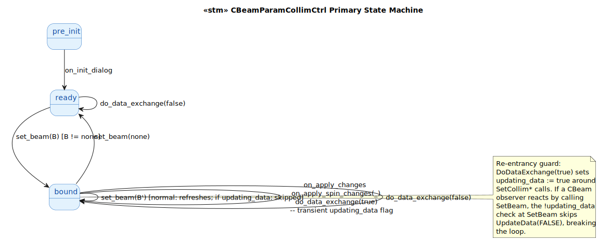
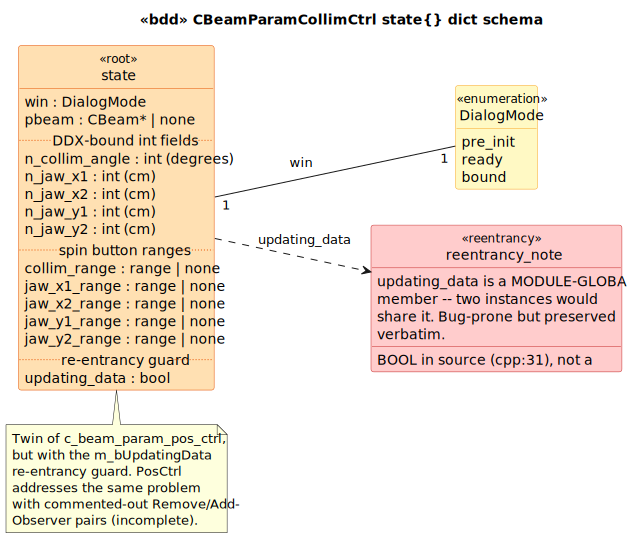

# CBeamParamCollimCtrl State Model

`CBeamParamCollimCtrl` is the **twin** of [`c_beam_param_pos_ctrl`](../c_beam_param_pos_ctrl/) — same MFC dialog pattern, same DDX bidirectional binding to a `CBeam`, but edits the **collimator+jaw parameters** (collim angle, jaw X1/X2/Y1/Y2) instead of position.

The interesting distinguishing feature: **a re-entrancy guard** that the position twin lacks.

## 1. Primary State Machine

**6 event terminals across 3 states** — same shape as the position twin.



> Source: [`diagrams/stm_primary.puml`](diagrams/stm_primary.puml)

## 2. State Dict Schema



> Source: [`diagrams/bdd_state_dict.puml`](diagrams/bdd_state_dict.puml)

| Field | Type | Source | Writers |
|---|---|---|---|
| `win` | `DialogMode` | LTS-level | `on_init_dialog`, `set_beam` |
| `pbeam` | `CBeam*` \| `none` | [`BeamParamCollimCtrl.h:55`](../../../../RT_VIEW/include/BeamParamCollimCtrl.h#L55) | `set_beam` |
| `n_collim_angle` | `int` (degrees) | [`BeamParamCollimCtrl.h:25`](../../../../RT_VIEW/include/BeamParamCollimCtrl.h#L25) | `do_data_exchange(false)` |
| `n_jaw_x1/x2/y1/y2` | `int` (cm) | [`BeamParamCollimCtrl.h:26-29`](../../../../RT_VIEW/include/BeamParamCollimCtrl.h#L26) | `do_data_exchange(false)` |
| `*_range` (5 fields) | `range` \| `none` | [`BeamParamCollimCtrl.cpp:115-119`](../../../../RT_VIEW/BeamParamCollimCtrl.cpp#L115) | `on_init_dialog` |
| **`updating_data`** | `bool` | [`BeamParamCollimCtrl.cpp:31`](../../../../RT_VIEW/BeamParamCollimCtrl.cpp#L31) | `do_data_exchange(true)` (transient) |

## 3. The re-entrancy guard

The notable difference from the position twin: a **module-global** `m_bUpdatingData` flag at [`cpp:31`](../../../../RT_VIEW/BeamParamCollimCtrl.cpp#L31):

```cpp
BOOL m_bUpdatingData = FALSE;          // module-global, NOT a member
...
void CBeamParamCollimCtrl::DoDataExchange(...) {
    ...
    if (pDX->m_bSaveAndValidate && m_pBeam != NULL) {
        m_bUpdatingData = TRUE;
        m_pBeam->SetCollimAngle(...);  // fires GetChangeEvent
        m_pBeam->SetCollimMin(...);    // fires GetChangeEvent
        m_pBeam->SetCollimMax(...);    // fires GetChangeEvent
        m_bUpdatingData = FALSE;
    }
}

void CBeamParamCollimCtrl::SetBeam(CBeam *pBeam) {
    m_pBeam = pBeam;
    if (::IsWindow(m_hWnd) && !m_bUpdatingData) {     // <- the guard
        UpdateData(FALSE);
    }
}
```

**Why it matters:** if a CBeam observer reacts to `SetCollimAngle` by calling `SetBeam` (e.g. a sister control that wants to re-bind), the `!m_bUpdatingData` check at SetBeam **skips** the `UpdateData(FALSE)` refresh that would otherwise re-enter `DoDataExchange` in load mode mid-save. That break the re-entrancy loop.

The twin `c_beam_param_pos_ctrl` solves the same problem (incompletely) with commented-out `RemoveObserver`/`AddObserver` pairs — the comparison reveals two attempted solutions to the same MFC re-entrancy concern, one applied and one abandoned.

## 4. Source quirks preserved verbatim

1. **Module-global flag** at [`cpp:31`](../../../../RT_VIEW/BeamParamCollimCtrl.cpp#L31) — `m_bUpdatingData` is NOT a member variable. Two `CBeamParamCollimCtrl` instances would share the flag. If both are alive simultaneously and one is doing a save while the other receives a `SetBeam`, the second would skip its UpdateData(FALSE) refresh inappropriately. Bug-prone but preserved verbatim.

2. **Commented-out batched setter** at [`cpp:66-67`](../../../../RT_VIEW/BeamParamCollimCtrl.cpp#L66):
   ```cpp
   // forBeam->SetAngles(((double)m_nCollimAngle) * PI / 180.0,
   //                     forBeam->myGantryAngle.Get(),
   //                     forBeam->myCouchAngle.Get());
   ```
   An earlier API style with a batched 3-angle setter (and `myGantryAngle`/`myCouchAngle` Value-pattern accessors) replaced by three separate setters using the modern `GetGantryAngle`/`SetCollimAngle`/etc.

3. **Asymmetric solution to the same problem.** Pos twin has commented-out RemoveObserver/AddObserver pairs (incomplete solution); Collim twin uses the m_bUpdatingData flag (complete-but-bug-prone solution). Two attempts at the same MFC re-entrancy concern coexist in the cohort.

## Source Mapping

| Event | C++ Source |
|---|---|
| `on_init_dialog` | `BeamParamCollimCtrl.cpp:110-122` |
| `set_beam(B)` | `BeamParamCollimCtrl.cpp:82-90` (with `!m_bUpdatingData` guard) |
| `on_apply_changes` | `BeamParamCollimCtrl.cpp:94-102` (`ON_EN_CHANGE` x5) |
| `on_apply_spin_changes(NMHDR)` | `BeamParamCollimCtrl.cpp:95-103` (`ON_NOTIFY UDN_DELTAPOS` x5) |
| `do_data_exchange(Save)` | `BeamParamCollimCtrl.cpp:33-80` |

### Cross-language references

The natural counterpart in modern Brimstone is part of `CPlanSetupDlg` (collimator panel within the same dialog as position). The re-entrancy concern is mooted in the modern code because ITK's `Modified()`/`Update()` chain has different semantics from MFC's `UpdateData(BOOL)`-driven DDX.
