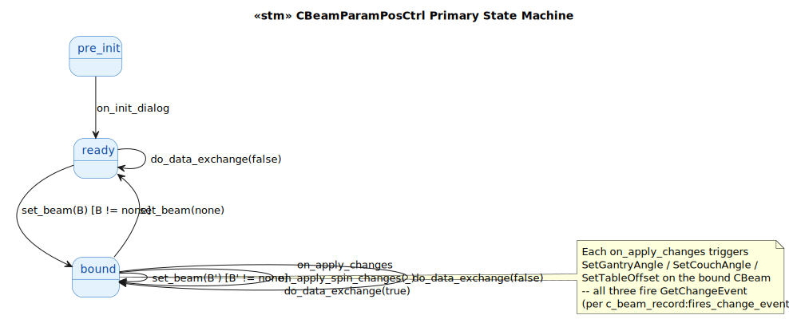
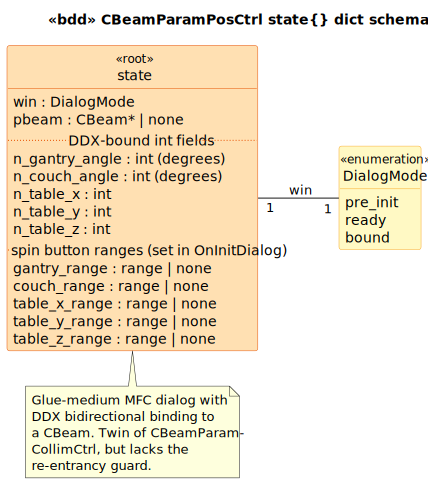

# CBeamParamPosCtrl State Model

`CBeamParamPosCtrl` is a `CDialog` subclass in the RT_VIEW project that edits a `CBeam`'s **position parameters** — gantry angle, couch angle, and table offset (X/Y/Z). Glue-medium target. Twin sibling of [`c_beam_param_collim_ctrl`](../c_beam_param_collim_ctrl/) which edits the collimator+jaw parameters.

This deliverable illustrates the **canonical MFC DDX (Dialog Data Exchange) pattern**: a single `DoDataExchange` method that handles bidirectional binding between dialog controls and a bound CBeam. The pattern is referenced by the cpp-state-model skill's "MFC extras" section.

## 1. Primary State Machine

**6 event terminals across 3 states** (`pre_init | ready | bound`).



> Source: [`diagrams/stm_primary.puml`](diagrams/stm_primary.puml)

The dialog has no modal/scan/confirm tiers — it's a simple property panel that toggles between "no beam attached" (`ready`) and "beam attached" (`bound`). The DDX pattern means every `on_apply_changes` event triggers `SetGantryAngle` / `SetCouchAngle` / `SetTableOffset` on the bound CBeam, each of which fires `GetChangeEvent` (per `c_beam_record:fires_change_event/1`).

## 2. State Dict Schema



> Source: [`diagrams/bdd_state_dict.puml`](diagrams/bdd_state_dict.puml)

| Field | Type | Source | Writers |
|---|---|---|---|
| `win` | `DialogMode` | LTS-level | `on_init_dialog`, `set_beam` |
| `pbeam` | `CBeam*` \| `none` | [`BeamParamPosCtrl.h:55`](../../../../RT_VIEW/include/BeamParamPosCtrl.h#L55) | `set_beam` |
| `n_gantry_angle` | `int` (degrees) | [`BeamParamPosCtrl.h:26`](../../../../RT_VIEW/include/BeamParamPosCtrl.h#L26) | `do_data_exchange(false)` (read FROM beam, rad→deg) |
| `n_couch_angle` | `int` (degrees) | [`BeamParamPosCtrl.h:25`](../../../../RT_VIEW/include/BeamParamPosCtrl.h#L25) | `do_data_exchange(false)` |
| `n_table_x/y/z` | `int` | [`BeamParamPosCtrl.h:27-29`](../../../../RT_VIEW/include/BeamParamPosCtrl.h#L27) | `do_data_exchange(false)` |
| `*_range` (5 fields) | `range` \| `none` | [`BeamParamPosCtrl.cpp:109-113`](../../../../RT_VIEW/BeamParamPosCtrl.cpp#L109) | `on_init_dialog` |

## 3. Event → Predicate Transformation Map

| Event | Guard | Transformation | State Fields Affected |
|---|---|---|---|
| `on_init_dialog` | `pre_init` | `edit_ops:on_init_dialog` | `win` (→ `ready`), 5 spin ranges set |
| `set_beam(B)` | `is_ready_or_bound` | `edit_ops:set_beam` | `pbeam`, `win`, all 5 `n_*` fields if B != none |
| `on_apply_changes` | `is_bound` | `edit_ops:apply_changes` → `do_data_exchange(true)` | (boundary writes to CBeam fire its change event) |
| `on_apply_spin_changes(NMHDR)` | `is_bound` | (forwards to `apply_changes`) | (same as above) |
| `do_data_exchange(false)` | `is_ready_or_bound` | direct (load FROM beam) | 5 `n_*` fields |
| `do_data_exchange(true)` | `is_ready_or_bound` | direct (save TO beam) | (no internal change; boundary fires CBeam event chain) |

The five `ON_EN_CHANGE` entries at [`cpp:88-96`](../../../../RT_VIEW/BeamParamPosCtrl.cpp#L88) all map to the same `OnApplyChanges` handler. The five `ON_NOTIFY UDN_DELTAPOS` entries at the alternating lines all map to `OnApplySpinChanges`, which itself just forwards to `OnApplyChanges`. **There is no per-field discrimination at the handler level** — the LTS uses a single event terminal per shape.

## 4. Source quirks preserved verbatim

1. **Three commented-out observer pairs** at [`cpp:63-69`](../../../../RT_VIEW/BeamParamPosCtrl.cpp#L63):
   ```cpp
   // m_pBeam->gantryAngle.RemoveObserver(this, (ChangeFunction) OnChange);
   m_pBeam->SetGantryAngle(((double)m_nGantryAngle) * PI / 180.0);
   //m_pBeam->gantryAngle.AddObserver(this, (ChangeFunction) OnChange);
   ```
   An earlier per-field observer pattern that was abandoned. The replacement strategy is unclear in this control — the twin `c_beam_param_collim_ctrl` uses an explicit `m_bUpdatingData` re-entrancy guard for the same problem.

2. **Commented-out RedrawWindow** at [`cpp:126`](../../../../RT_VIEW/BeamParamPosCtrl.cpp#L126). `OnApplyChanges` should rely on the CBeam change event to drive redraws, not direct invalidation.

3. **No re-entrancy guard.** Unlike the twin `c_beam_param_collim_ctrl`, this control does NOT have an `m_bUpdatingData` flag. If a CBeam observer reacts to `SetGantryAngle/SetCouchAngle/SetTableOffset` by calling `SetBeam`, this control would re-enter `DoDataExchange` in load mode mid-save. Whether this is a real bug depends on whether any actual observer triggers that pattern; the commented-out RemoveObserver/AddObserver pairs at cpp:63-69 suggest the author was at least aware of the concern.

## Source Mapping

| Event | C++ Source |
|---|---|
| `on_init_dialog` | `BeamParamPosCtrl.cpp:104-117` |
| `set_beam(B)` | `BeamParamPosCtrl.cpp:76-84` |
| `on_apply_changes` | `BeamParamPosCtrl.cpp:88-96` (`ON_EN_CHANGE` x5) → `:119-128` |
| `on_apply_spin_changes(NMHDR)` | `BeamParamPosCtrl.cpp:89-97` (`ON_NOTIFY UDN_DELTAPOS` x5) → `:130-136` |
| `do_data_exchange(Save)` | `BeamParamPosCtrl.cpp:32-74` |

### Cross-language references

The closest counterpart in modern Brimstone is **`CPlanSetupDlg` in [`Brimstone/PlanSetupDlg.cpp`](../../../../Brimstone/PlanSetupDlg.cpp)** — also a CDialog with DDX-bound fields editing beam parameters. The DDX pattern bisimulates closely. Modern Brimstone uses ITK's `Modified()` chain instead of `CObservableObject::GetChangeEvent()`, which is a tau-related divergence.
