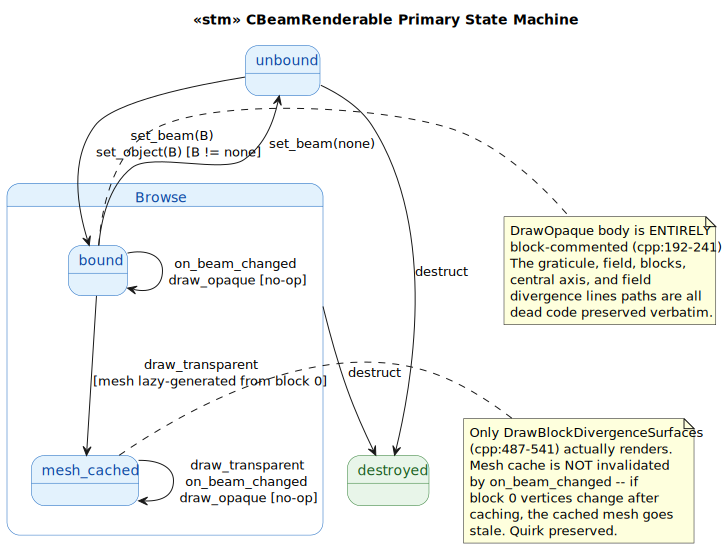
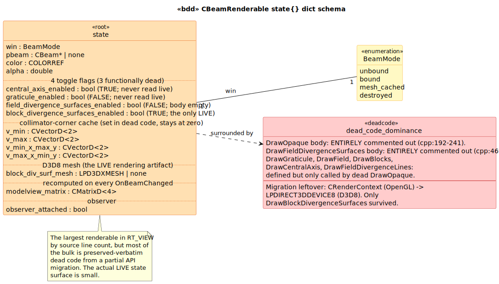

# CBeamRenderable State Model

`CBeamRenderable` is a `CRenderable` subclass that renders the treatment beam's geometry — collimator field rectangle, shielding-block divergence surfaces, central axis, field-divergence lines and surfaces — into a CSceneView. **The largest renderable in RT_VIEW by source line count (~600 lines), but most of the bulk is preserved-verbatim dead code from a partial API migration** from `CRenderContext` (OpenGL) to `LPDIRECT3DDEVICE8` (D3D8). Only `DrawBlockDivergenceSurfaces` survived the migration; everything else is block-commented or unreachable.

## 1. Primary State Machine

**6 event terminals across 4 states** (`unbound | bound | mesh_cached | destroyed`).

> Source: [`diagrams/stm_primary.puml`](diagrams/stm_primary.puml)

The `mesh_cached` sub-state distinguishes "block-0 mesh has been lazily generated" from just-bound. Once cached, the mesh is **never regenerated** — even when `OnBeamChanged` fires (which only recomputes the modelview matrix). This is one of the preserved quirks below: if the block 0 vertices change after the first DrawTransparent, the cache becomes stale.

## 2. State Dict Schema

> Source: [`diagrams/bdd_state_dict.puml`](diagrams/bdd_state_dict.puml)

| Field | Type | Source | Live? |
|---|---|---|---|
| `win` | `BeamMode` | LTS-level | yes |
| `pbeam` | `CBeam*` \| `none` | accessed via GetObject() | yes |
| `color` / `alpha` | `COLORREF` / `double` | [`cpp:103-104`](../../../../RT_VIEW/BeamRenderable.cpp#L103) (default green @ 0.25) | yes |
| `central_axis_enabled` | `bool` (TRUE) | [`BeamRenderable.h:77`](../../../../RT_VIEW/include/BeamRenderable.h#L77) | **dead** — only read by commented-out DrawOpaque |
| `graticule_enabled` | `bool` (FALSE) | [`BeamRenderable.h:78`](../../../../RT_VIEW/include/BeamRenderable.h#L78) | **dead** — only read by DrawGraticule, called only from dead DrawOpaque |
| `field_divergence_surfaces_enabled` | `bool` (FALSE) | [`BeamRenderable.h:79`](../../../../RT_VIEW/include/BeamRenderable.h#L79) | **dead** — body of DrawFieldDivergenceSurfaces is empty |
| `block_divergence_surfaces_enabled` | `bool` (TRUE) | [`BeamRenderable.h:80`](../../../../RT_VIEW/include/BeamRenderable.h#L80) | **the only LIVE flag** |
| `v_min` / `v_max` / `v_min_x_max_y` / `v_max_x_min_y` | `CVectorD<2>` | [`BeamRenderable.h:71-74`](../../../../RT_VIEW/include/BeamRenderable.h#L71) | dead — set in dead DrawOpaque, used by dead helpers |
| `block_div_surf_mesh` | `LPD3DXMESH` \| `none` | [`BeamRenderable.h:83`](../../../../RT_VIEW/include/BeamRenderable.h#L83) | **the LIVE rendering artifact** |
| `modelview_matrix` | `CMatrixD<4>` | inherited from CRenderable | yes — recomputed by OnBeamChanged |
| `observer_attached` | `bool` | [`cpp:160-173`](../../../../RT_VIEW/BeamRenderable.cpp#L160) | yes |

## 3. Dead-code dominance

What `CBeamRenderable.cpp` *appears* to do (per the `.h`'s declared method list) and what it *actually* does are very different:

| Method | Status | Lines | Behavior |
|---|---|---|---|
| `DrawOpaque` | **DEAD** | [`cpp:190-242`](../../../../RT_VIEW/BeamRenderable.cpp#L190) | Body entirely block-commented |
| `DrawTransparent` | LIVE (partially) | [`cpp:438-457`](../../../../RT_VIEW/BeamRenderable.cpp#L438) | Only `DrawBlockDivergenceSurfaces` runs; the smooth-shading/lighting setup and `DrawFieldDivergenceSurfaces` calls are commented out |
| `DrawBlockDivergenceSurfaces` | LIVE | [`cpp:487-541`](../../../../RT_VIEW/BeamRenderable.cpp#L487) | The only working renderer |
| `DrawFieldDivergenceSurfaces` | DEAD | [`cpp:465-480`](../../../../RT_VIEW/BeamRenderable.cpp#L465) | Body block-commented |
| `DrawGraticule` | DEAD | [`cpp:272-340`](../../../../RT_VIEW/BeamRenderable.cpp#L272) | Defined but only called by dead DrawOpaque |
| `DrawField` | DEAD | [`cpp:346-358`](../../../../RT_VIEW/BeamRenderable.cpp#L346) | Defined but only called by dead DrawOpaque |
| `DrawBlocks` | DEAD | [`cpp:363-381`](../../../../RT_VIEW/BeamRenderable.cpp#L363) | Defined but only called by dead DrawOpaque |
| `DrawCentralAxis` | DEAD | [`cpp:387-414`](../../../../RT_VIEW/BeamRenderable.cpp#L387) | Defined but only called by dead DrawOpaque |
| `DrawFieldDivergenceLines` | DEAD | [`cpp:420-432`](../../../../RT_VIEW/BeamRenderable.cpp#L420) | Defined but only called by dead DrawOpaque |
| `OnBeamChanged` | LIVE | [`cpp:249-265`](../../../../RT_VIEW/BeamRenderable.cpp#L249) | Recomputes modelview matrix, calls Invalidate |

The migration story implied: the original implementation took `CRenderContext *pRC` parameters and used OpenGL idioms (`pRC->BeginLines`, `pRC->Vertex`, `pRC->Translate`). The signature was changed to `LPDIRECT3DDEVICE8 pd3dDev` for the D3D8 port, but only `DrawBlockDivergenceSurfaces` was actually re-implemented in the new API. Everything else was preserved as documentation rather than code.

## 4. Source quirks preserved verbatim

1. **Dead `DrawOpaque` body** at [`cpp:192-241`](../../../../RT_VIEW/BeamRenderable.cpp#L192). Originally rendered graticule + field rectangle (at SCD and SID planes) + blocks (twice) + central axis + field divergence lines. None of it runs.

2. **Dead `DrawFieldDivergenceSurfaces` body** at [`cpp:469-478`](../../../../RT_VIEW/BeamRenderable.cpp#L469). Even when reached from DrawTransparent (it's not — the call is commented out at cpp:445), the body would do nothing.

3. **Three of four toggle flags are functionally dead.** Only `m_bBlockDivergenceSurfacesEnabled` (init TRUE) is read by live code. The other three (`m_bCentralAxisEnabled`, `m_bGraticuleEnabled`, `m_bFieldDivergenceSurfacesEnabled`) are init-and-forget.

4. **Mesh cache is never invalidated.** [`cpp:489-540`](../../../../RT_VIEW/BeamRenderable.cpp#L489): the lazy generation runs only when `m_pBlockDivSurfMesh == NULL`. `OnBeamChanged` does NOT clear the cache. If the bound CBeam's block 0 vertices change after the first render, the cached mesh becomes stale silently. The cache is released only on destruction (cpp:114-117). Quirk preserved.

5. **Hard-coded block index 0** at [`cpp:493`](../../../../RT_VIEW/BeamRenderable.cpp#L493): `GetBeam()->GetBlock(0)`. If the beam has multiple blocks, only block 0 renders.

6. **Three commented-out IPolygon3D / SafeArray lines** at [`cpp:494-498`](../../../../RT_VIEW/BeamRenderable.cpp#L494). Earlier COM-based block geometry access; replaced by the direct `CPolygon*` API.

7. **Z-flip in modelview matrix** at [`cpp:259`](../../../../RT_VIEW/BeamRenderable.cpp#L259): `CreateScale(CVectorD<3>(1.0, 1.0, -1.0))`. Reconciles IEC convention (beam down +Z) with screen-Z (out of screen +Z).

## Source Mapping

| Event | C++ Source |
|---|---|
| `set_beam(B)` | `BeamRenderable.cpp:143-147` (one-line wrapper) |
| `set_object(O)` | `BeamRenderable.cpp:154-183` |
| `draw_opaque` | `BeamRenderable.cpp:190-242` (dead body) |
| `draw_transparent` | `BeamRenderable.cpp:438-457` |
| `on_beam_changed` | `BeamRenderable.cpp:249-265` |
| `destruct` | `BeamRenderable.cpp:112-118` (releases m_pBlockDivSurfMesh) |

Helper methods that exist but are reachable only by the dead code path: `DrawGraticule`, `DrawField`, `DrawBlocks`, `DrawCentralAxis`, `DrawFieldDivergenceLines`, `DrawFieldDivergenceSurfaces`. Documented in the LTS comments but not in the event alphabet because they cannot be triggered by any live event flow.

### Cross-language references

The natural counterpart in modern Brimstone is **absent** — the modern stack does not render a 3-D beam frustum geometry. As with `CMachineRenderable`, the beam-geometry-as-renderable abstraction was abandoned in favor of beam-geometry-as-implicit-kernel (the dose calculation in `BeamDoseCalc.cpp` uses beam parameters directly without producing a visualization). The block-divergence surface rendering is the most visually distinctive feature of `CBeamRenderable`, and it has no modern descendant.

The dead-code dominance here is illustrative of the **`DEVELOPMENT_TIMELINE.md` Part 7 historical-modeling rationale**: a class that *appears* to do many things (per its method declarations) actually does only one. Without the LTS analysis, a reviewer might assume the field-divergence surfaces and graticule actually render. The model makes the behavioral truth explicit and queryable.
