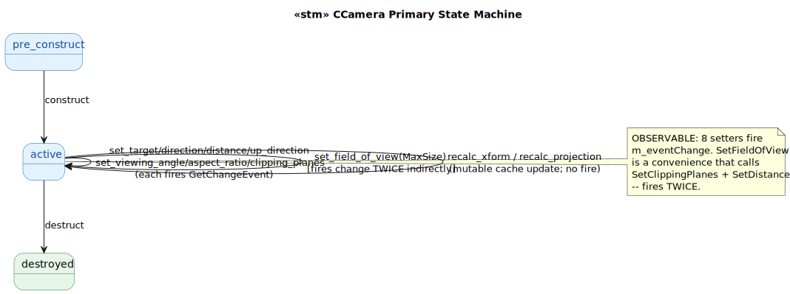
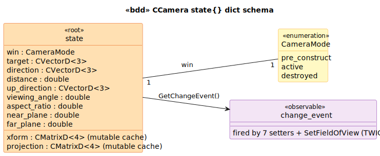

# CCamera State Model

`CCamera` is the viewpoint primitive owned by a `CSceneView`. **OBSERVABLE** — pairs with `c_beam` and `c_texture` in the GetChangeEvent-fan-out pattern.

## Observer fan-out

7 setters fire `m_eventChange` directly, plus `SetFieldOfView` fires it **twice** indirectly via `SetClippingPlanes + SetDistance`. The `c_camera_record:fires_change_event/1` predicate enumerates them:

| Setter | C++ source | Fires once or twice? |
|---|---|---|
| `set_target(V)` | `Camera.cpp:67-77` | once |
| `set_direction(V)` | `Camera.cpp:84-94` | once |
| `set_distance(D)` | `Camera.cpp:114-124` | once |
| `set_up_direction(V)` | `Camera.cpp:132-143` | once |
| `set_viewing_angle(A)` | `Camera.cpp:175-184` | once |
| `set_aspect_ratio(R)` | `Camera.cpp:201-213` | once |
| `set_clipping_planes(N, F)` | `Camera.cpp:240-250` | once |
| `set_field_of_view(MaxSize)` | `Camera.cpp:258-263` | **twice** (calls SetClippingPlanes + SetDistance) |

## State Machine

> Source: [`diagrams/stm_primary.puml`](diagrams/stm_primary.puml)

## Schema

> Source: [`diagrams/bdd_state_dict.puml`](diagrams/bdd_state_dict.puml)

## Source quirks

1. **`m_mXform` and `m_mProjection` are `mutable`** — lazily recomputed inside const getters via `RecalcCameraToModel` / `RecalcProjection`. Same pattern as CBeam's beam-to-fixed/patient xforms.
2. **SetFieldOfView fires twice** — observers see two notifications from one logical setter. The double-fire is reachable via swipl reachability queries (every `set_field_of_view` in a valid_sequence corresponds to two observable change events downstream).
3. **Commented-out duplicate declaration** at `Camera.h:78`: `// const CMatrixD<4>& GetProjection() const;` — a stale forward-declare left in.

## Source Mapping

| Event | C++ Source |
|---|---|
| `construct` | `Camera.cpp:32-55` |
| 7 setters + `set_field_of_view` | `Camera.cpp:67-263` |
| `recalc_xform` | `Camera.cpp:280-307` (const helper) |
| `recalc_projection` | `Camera.cpp:310-337` (const helper) |
| `destruct` | `Camera.cpp:57-59` |
