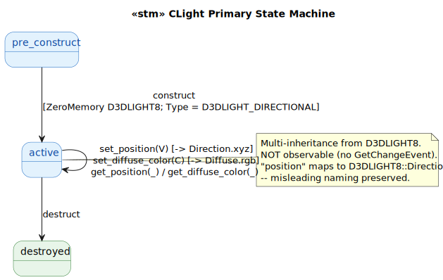
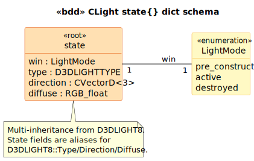

# CLight State Model

`CLight` is a thin wrapper around D3D8's `D3DLIGHT8` struct, exposed via `CObject + D3DLIGHT8` multi-inheritance. Glue-light.

## State Machine

> Source: [`diagrams/stm_primary.puml`](diagrams/stm_primary.puml)

## Schema

> Source: [`diagrams/bdd_state_dict.puml`](diagrams/bdd_state_dict.puml)

## Source quirks preserved verbatim

1. **Multi-inheritance from D3DLIGHT8** (a POD struct) plus `CObject`. The ctor casts `this` to `D3DLIGHT8*` and `ZeroMemory`s it at [`Light.cpp:34`](../../../../GEOM_VIEW/Light.cpp#L34). Brittle — assumes `CObject`'s layout doesn't have a vptr that the ZeroMemory clobbers. MFC's CObject DOES have a vtbl, so this is undefined behavior. Preserved verbatim.

2. **"Position" maps to D3DLIGHT8::Direction**. The class exposes `GetPosition`/`SetPosition` accessors but stores the value as `Direction.x/y/z`. For a directional light, "position" doesn't exist — the vector is the LIGHT DIRECTION. Misleading naming preserved.

3. **#else fallback paths are dead.** The `#ifdef D3D8 ... #else ... #endif` blocks at multiple sites suggest an abandoned OpenGL fallback. `D3D8` is `#define`d unconditionally at `Light.h:16`, so the `#else` branches are never reached.

4. **Not observable** — unlike `CCamera` which fires `m_eventChange` on every setter, `CLight` is a pure record. Views that need to react to light changes must poll.

## Source Mapping

| Event | C++ Source |
|---|---|
| `construct` | `Light.cpp:30-39` |
| `set_position(V)` / `get_position` | `Light.cpp:55-76` |
| `set_diffuse_color(C)` / `get_diffuse_color` | `Light.cpp:83-105` |
| `destruct` | `Light.cpp:46-48` (empty body) |
