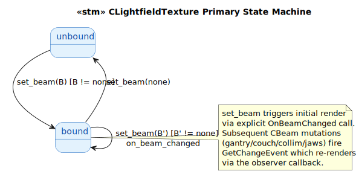
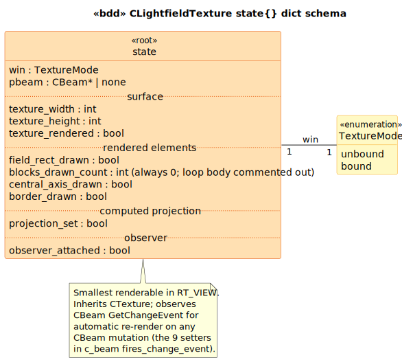

# CLightfieldTexture State Model

`CLightfieldTexture` is a `CTexture` subclass that renders a diagrammatic representation of a `CBeam`'s **light-field** — the visible projection that simulates the room light shining through the collimator + blocks. It draws the collimator rectangle, the (currently disabled) shielding-block polygons, a central-axis crosshair, and a border onto a 512×512 GDI surface, then computes a texture-space projection matrix combining the texture-size scaling, the treatment-machine projection, and the inverse beam-to-patient transform.

The smallest renderable in RT_VIEW (~150 lines source). 2 events, 2 states.

## 1. Primary State Machine



> Source: [`diagrams/stm_primary.puml`](diagrams/stm_primary.puml)

The texture toggles between `unbound` (no CBeam attached, surface empty) and `bound` (CBeam attached, observer registered, surface rendered). Re-bind to a different beam transitions through bound→bound (with detach/attach observer pair). `set_beam(none)` returns to `unbound`.

## 2. State Dict Schema



> Source: [`diagrams/bdd_state_dict.puml`](diagrams/bdd_state_dict.puml)

| Field | Type | Source |
|---|---|---|
| `win` | `TextureMode` | LTS-level |
| `pbeam` | `CBeam*` \| `none` | [`LightfieldTexture.h:29`](../../../../RT_VIEW/include/LightfieldTexture.h#L29) |
| `texture_width` / `_height` | `int` | [`LightfieldTexture.cpp:75`](../../../../RT_VIEW/LightfieldTexture.cpp#L75) (`SetWidthHeight(512, 512)`) |
| `texture_rendered` | `bool` | derived from OnBeamChanged completion |
| `field_rect_drawn` | `bool` | [`LightfieldTexture.cpp:95`](../../../../RT_VIEW/LightfieldTexture.cpp#L95) |
| `blocks_drawn_count` | `int` | [`LightfieldTexture.cpp:100-115`](../../../../RT_VIEW/LightfieldTexture.cpp#L100) — always 0 (loop body commented out) |
| `central_axis_drawn` | `bool` | [`LightfieldTexture.cpp:118-125`](../../../../RT_VIEW/LightfieldTexture.cpp#L118) |
| `border_drawn` | `bool` | [`LightfieldTexture.cpp:130`](../../../../RT_VIEW/LightfieldTexture.cpp#L130) |
| `projection_set` | `bool` | [`LightfieldTexture.cpp:135-156`](../../../../RT_VIEW/LightfieldTexture.cpp#L135) |
| `observer_attached` | `bool` | [`LightfieldTexture.cpp:46-65`](../../../../RT_VIEW/LightfieldTexture.cpp#L46) |

## 3. Source quirks preserved verbatim

1. **NULL-deref hazard at SetBeam end.** [`cpp:64`](../../../../RT_VIEW/LightfieldTexture.cpp#L64) calls `OnBeamChanged(&GetBeam()->GetChangeEvent(), NULL)` to force initial render. `GetBeam()->GetChangeEvent()` dereferences without first checking that pBeam is non-null. The `OnBeamChanged` handler itself guards against null at cpp:70-73, but the *caller* doesn't guard the `GetChangeEvent()` deref. If `SetBeam(NULL)` is called when no beam was previously attached, this is a safe path (the early `if (m_pBeam != NULL) RemoveObserver` skip means we go to assignment then to `if (m_pBeam != NULL) AddObserver` skip then to the unconditional `OnBeamChanged(GetBeam()->GetChangeEvent(),...)` — which dereferences). Real bug, preserved verbatim.

2. **Block-rendering loop body entirely commented out** at [`cpp:102-114`](../../../../RT_VIEW/LightfieldTexture.cpp#L102):
   ```cpp
   for (int nAt = 0; nAt < GetBeam()->GetBlockCount(); nAt++)
   {
   /*  ...polygon-block rendering... */
   }
   ```
   The loop iterates `GetBlockCount()` times but does nothing. The polygon-block rendering was the original feature; the iteration count is preserved (and observable via TRACE in some debug build) but has no visual effect.

3. **Two commented-out `glMultMatrix` calls** at [`cpp:147,154`](../../../../RT_VIEW/LightfieldTexture.cpp#L147). Replaced by direct CMatrixD multiplication with mTex. The OpenGL-style direct-state-API was abandoned for a more functional matrix-composition pattern.

4. **PEN_THICKNESS = TEX_RESOLUTION / 100 = 5 pixels** (hard-coded constant). The line thickness is proportional to the resolution — a 1024-resolution texture would have 10-pixel pens.

## Source Mapping

| Event | C++ Source |
|---|---|
| `set_beam(B)` | `LightfieldTexture.cpp:44-65` |
| `on_beam_changed` | `LightfieldTexture.cpp:68-157` |

### Cross-language references

No direct counterpart in modern Brimstone — the light-field-texture rendering is a VSim-era feature tied to CT-simulator workflow. The closest analog in modern Brimstone is `Brimstone/PlanarView::DrawImages` which renders dose+CT slices but not a separate light-field texture. The rendered diagrammatic style (collimator rectangle + central-axis crosshair) is a CT-simulator convention rather than a treatment-planning one.

The natural pairing for this LTS is the **`c_beam` glue-light summary** — every `CBeam` setter in `c_beam_record:fires_change_event/1` triggers an `on_beam_changed` event here through the observer chain. A multi-class query "what user action causes the light-field texture to re-render?" enumerates those 9 setters.
