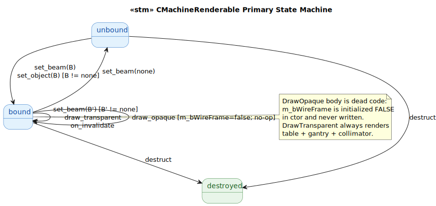
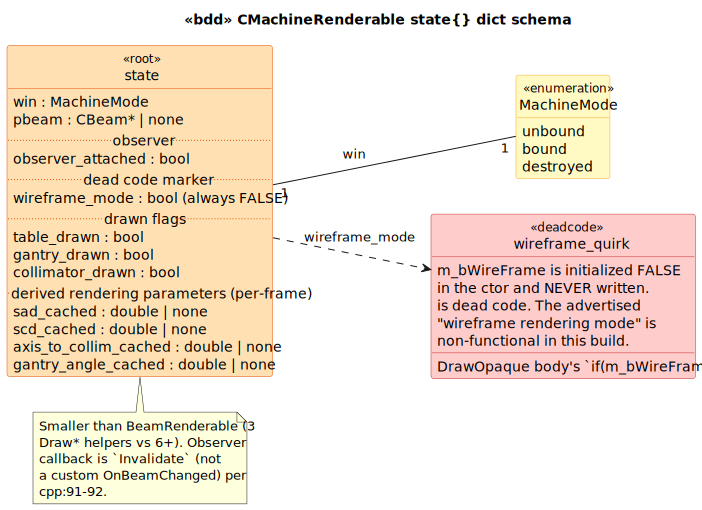

# CMachineRenderable State Model

`CMachineRenderable` is a `CRenderable` subclass that draws a 3-D depiction of the treatment machine — table, gantry, collimator — into a CSceneView, parametrized by the gantry angle and the SAD/SCD distances of the bound CBeam's CTreatmentMachine. Glue-medium target with one **significant dead-code preservation**.

## 1. Primary State Machine

**6 event terminals across 3 states** (`unbound | bound | destroyed`).

> Source: [`diagrams/stm_primary.puml`](diagrams/stm_primary.puml)

## 2. State Dict Schema

> Source: [`diagrams/bdd_state_dict.puml`](diagrams/bdd_state_dict.puml)

| Field | Type | Source |
|---|---|---|
| `win` | `MachineMode` | LTS-level |
| `pbeam` | `CBeam*` \| `none` | accessed via `GetObject()` per `CRenderable` base |
| `wireframe_mode` | `bool` (always FALSE) | [`MachineRenderable.h:53`](../../../../RT_VIEW/include/MachineRenderable.h#L53) — **dead code marker** |
| `observer_attached` | `bool` | [`MachineRenderable.cpp:79-93`](../../../../RT_VIEW/MachineRenderable.cpp#L79) |
| `table_drawn` / `gantry_drawn` / `collimator_drawn` | `bool` | per-frame markers |
| `sad_cached` / `scd_cached` / `axis_to_collim_cached` / `gantry_angle_cached` | `double` \| `none` | recomputed per-frame from CBeam in DrawTransparent |

## 3. The dead-code preservation

`m_bWireFrame` is the most striking preserved quirk in this control:

- Declared at [`MachineRenderable.h:53`](../../../../RT_VIEW/include/MachineRenderable.h#L53)
- Initialized to `FALSE` in the constructor at [`cpp:35`](../../../../RT_VIEW/MachineRenderable.cpp#L35)
- Read once at [`cpp:107`](../../../../RT_VIEW/MachineRenderable.cpp#L107) in `DrawOpaque`
- **Never written anywhere else**

So `DrawOpaque`'s entire body is dead code: the `if (m_bWireFrame)` branch is always false; there is no else branch. The "wireframe vs solid rendering mode" advertised by the implementation is non-functional in this build.

`DrawTransparent` does the actual rendering unconditionally. If `m_bWireFrame` were ever flipped TRUE, the machine would be rendered **twice** per frame — once as wireframe lines, once as filled polygons — with z-fighting between the line geometry and the fill. The lack of double-render hazard in practice is purely an artifact of the dead-code state.

## 4. Source quirks preserved verbatim

1. **`m_bWireFrame` dead code** — see Section 3.

2. **DrawTransparent is the only rendering path.** [`cpp:137-156`](../../../../RT_VIEW/MachineRenderable.cpp#L137) unconditionally draws table + gantry + collimator. The MFC `CRenderable` framework still calls `DrawOpaque` first (for the opaque-pass), but it does nothing.

3. **Observer callback is `Invalidate`**, not a custom `OnBeamChanged`. At [`cpp:91-92`](../../../../RT_VIEW/MachineRenderable.cpp#L91), the AddObserver registers `CRenderable::Invalidate` as the callback. Every CBeam GetChangeEvent fire just marks this renderable as needing redraw on the next frame — synchronous re-render is *not* triggered. Compare to `CLightfieldTexture` which registers a custom `OnBeamChanged` that re-renders synchronously.

4. **`SetBeam` is a one-line wrapper around `SetObject`.** [`cpp:63-66`](../../../../RT_VIEW/MachineRenderable.cpp#L63). Both events are exposed in the LTS so cross-class queries can use either name.

5. **No SAD/SCD caching.** Both DrawOpaque and DrawTransparent re-fetch `GetTreatmentMachine()->GetSAD()` and `GetSCD()` every frame, despite these values being constant between SetBeam calls. The `_cached` fields in the LTS state are descriptive (per-frame derivations recorded), not behavioral (no caching mechanism in source).

## Source Mapping

| Event | C++ Source |
|---|---|
| `set_beam(B)` | `MachineRenderable.cpp:63-66` (one-line wrapper) |
| `set_object(O)` | `MachineRenderable.cpp:73-97` |
| `draw_opaque` | `MachineRenderable.cpp:104-130` (dead code path) |
| `draw_transparent` | `MachineRenderable.cpp:137-156` |
| `on_invalidate` | inherited from `CRenderable`; observer callback at cpp:91-92 |
| `destruct` | `MachineRenderable.cpp:44-46` (empty body) |

### Cross-language references

The natural counterpart in modern Brimstone is **absent** — the modern stack does not render a 3-D machine geometry. Brimstone is a 2-D dose-planning UI; the room's-eye view with full machine rendering was a VSim CT-simulator feature that wasn't preserved. The kernel data files at [`Brimstone/6MV_kernel.dat`](../../../../Brimstone/6MV_kernel.dat) etc. encode beam-energy characteristics implicitly without needing a 3-D machine model.

This is one of the cleanest cases of intentional divergence in the historical → modern transition: machine geometry as a renderable abstraction was abandoned in favor of machine geometry as opaque kernel data. The two preserved-quirks here (dead `m_bWireFrame` and absent SAD/SCD caching) are typical of features that were never quite finished before the abstraction was dropped.
