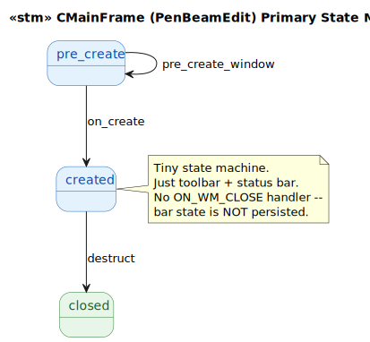
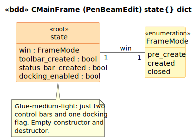

# CMainFrame (PenBeamEdit) State Model

`CMainFrame` is the `CFrameWnd` subclass for PenBeamEdit's main window. The lightest of the three glue-medium PenBeamEdit deliverables — about a third of the OnCreate complexity of VSIM_OGL's MainFrame, only ON_WM_CREATE in the message map, no docking control bars, no object explorer, no beam-param tab control.

## 1. Primary State Machine

**3 event terminals across 3 states** (`pre_create | created | closed`).

> Source: [`diagrams/stm_primary.puml`](diagrams/stm_primary.puml)

## 2. State Dict Schema

> Source: [`diagrams/bdd_state_dict.puml`](diagrams/bdd_state_dict.puml)

| Field | Type | C++ source | Writers |
|---|---|---|---|
| `win` | `FrameMode` | LTS-level | `on_create`, `destruct` |
| `toolbar_created` | `bool` | [`MainFrm.cpp:54-66`](../../../../PenBeamEdit/MainFrm.cpp#L54) | `on_create` |
| `status_bar_created` | `bool` | [`MainFrm.cpp:62-68`](../../../../PenBeamEdit/MainFrm.cpp#L62) | `on_create` |
| `docking_enabled` | `bool` | [`MainFrm.cpp:72-74`](../../../../PenBeamEdit/MainFrm.cpp#L72) | `on_create` |

## 3. Event → Predicate Transformation Map

| Event | Guard | Transformation | State Fields Affected |
|---|---|---|---|
| `pre_create_window` | `win == pre_create` | (no-op) | (none) |
| `on_create` | `win == pre_create` | `edit_ops:on_create` | `win`, `toolbar_created`, `status_bar_created`, `docking_enabled` |
| `destruct` | `is_created` | direct | `win` (→ `closed`) |

## 4. Source quirks preserved verbatim

1. **No `ON_WM_CLOSE` handler.** VSIM_OGL's MainFrame saves bar state via `SaveBarState("ControlBars")` in OnClose; PenBeamEdit's does not. The framework default OnClose runs and bar state is **not** persisted across runs. Preserved verbatim — a reviewer who repositions the toolbar should expect the change to be lost on app exit.

2. **Empty constructor and destructor** at [`MainFrm.cpp:39-43,45-47`](../../../../PenBeamEdit/MainFrm.cpp#L39). The embedded `m_wndToolBar`/`m_wndStatusBar` own their resources via stack-style composition.

## Source Mapping

| Event | C++ Source |
|---|---|
| `pre_create_window` | `MainFrm.cpp:79-87` |
| `on_create` | `MainFrm.cpp:24` (`ON_WM_CREATE`) → `:49-77` |
| `destruct` | `MainFrm.cpp:45-47` (~CMainFrame, empty body) |

### Cross-language references

The natural counterpart is `Brimstone/MainFrm.cpp` (CFrameWnd subclass for the modern Brimstone). The modern frame is much heavier — it owns the prescription bar, prescription toolbar, and registers tree-item classes. Even VSIM_OGL's MainFrame is heavier than this one. PenBeamEdit's MainFrame is the **simplest** of the three CFrameWnd implementations across the lineage, reflecting its identity as a research testbed where UI was minimal. The bisimulation against either VSIM_OGL or modern Brimstone is mostly an *observation* that PenBeamEdit's frame does less, not a substantial mapping.
