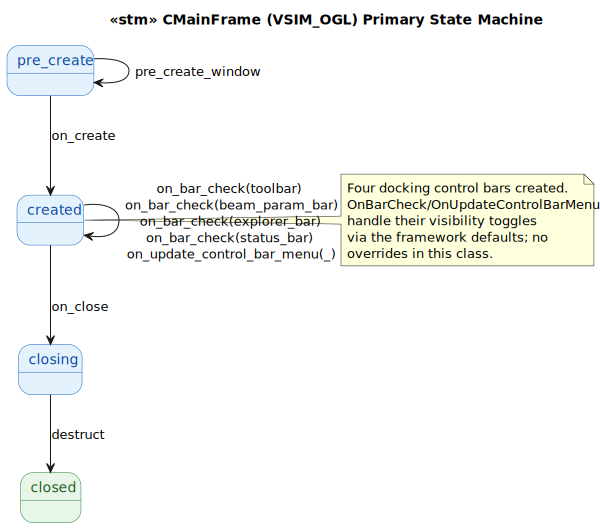
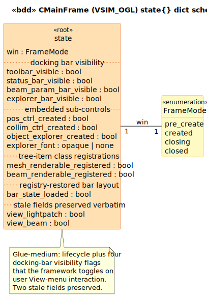

# CMainFrame (VSIM_OGL) State Model

`CMainFrame` is the `CFrameWnd` subclass that owns the VSIM_OGL main window — toolbar, status bar, the two docking control bars (BeamParam tab control + Object Explorer), and the embedded sub-controls (`CBeamParamPosCtrl`, `CBeamParamCollimCtrl`). Glue-medium target: small message map (4 entries), heavy `OnCreate`, framework-managed bar visibility toggles.

## 1. Primary State Machine

**8 event terminals across 4 states** (`pre_create | created | closing | closed`).

> Source: [`diagrams/stm_primary.puml`](diagrams/stm_primary.puml)

`OnCreate` is the heavy transition: it creates the toolbar, status bar, beam-param tab-control bar (with two embedded controls — Position and Collim), the object-explorer dialog bar (with the embedded `CObjectExplorer`), creates and configures the explorer font (Arial 18), registers the `CMesh→CSurfaceRenderable` and `CBeam→CBeamRenderable` tree-item class mappings, enables docking on three bars, and restores the last bar layout via `LoadBarState("ControlBars")`. All in one MFC framework callback at [`MainFrm.cpp:55-149`](../../../../VSIM_OGL/MainFrm.cpp#L55).

`OnClose` saves the bar layout via `SaveBarState("ControlBars")` then forwards to `CFrameWnd::OnClose`. The destructor deletes `m_pExplorerFont`.

The bar-toggle event `on_bar_check(BarId)` is parameterized so cross-class queries can distinguish toolbar vs beam-param vs explorer toggles (the `BarId` carries the resource id).

## 2. State Dict Schema

> Source: [`diagrams/bdd_state_dict.puml`](diagrams/bdd_state_dict.puml)

| Field group | Fields | Source |
|---|---|---|
| Lifecycle | `win` | LTS-level |
| Docking bar visibility | `toolbar_visible`, `status_bar_visible`, `beam_param_bar_visible`, `explorer_bar_visible` | `MainFrm.cpp:60-93` (creation flags) + framework toggles |
| Embedded sub-controls | `pos_ctrl_created`, `collim_ctrl_created`, `object_explorer_created` | `MainFrm.cpp:84-110` |
| Explorer font | `explorer_font` | `MainFrm.cpp:116-123, :52` |
| Tree-item registrations | `mesh_renderable_registered`, `beam_renderable_registered` | `MainFrm.cpp:127-130` |
| Registry-restored bar layout | `bar_state_loaded` | `MainFrm.cpp:146` (load), `:183` (save) |
| Stale fields preserved | `view_lightpatch`, `view_beam` | `MainFrm.h:64-65` (init in ctor, never read/written) |

### Stale fields

`m_bViewLightpatch` (init `FALSE`) and `m_bViewBeam` (init `TRUE`) at [`MainFrm.h:64-65`](../../../../VSIM_OGL/MainFrm.h#L64) are initialized in the ctor and **never read or written elsewhere**. The `ID_VIEW_BEAM`/`ID_VIEW_LIGHTPATCH` toggles are owned by `CSimView` instead. Preserved here verbatim for memory-layout fidelity.

## 3. Event → Predicate Transformation Map

| Event | Guard | Transformation | State Fields Affected |
|---|---|---|---|
| `pre_create_window` | `win == pre_create` | (no-op) | (none) |
| `on_create` | `win == pre_create` | `edit_ops:on_create` | `win`, plus all 11 creation/registration fields |
| `on_bar_check(toolbar)` | `is_created` | `edit_ops:toggle_bar(_, toolbar, _)` | `toolbar_visible` |
| `on_bar_check(beam_param_bar)` | `is_created` | `edit_ops:toggle_bar(_, beam_param_bar, _)` | `beam_param_bar_visible` |
| `on_bar_check(explorer_bar)` | `is_created` | `edit_ops:toggle_bar(_, explorer_bar, _)` | `explorer_bar_visible` |
| `on_bar_check(status_bar)` | `is_created` | `edit_ops:toggle_bar(_, status_bar, _)` | `status_bar_visible` |
| `on_update_control_bar_menu(BarId)` | (none) | (no-op; framework reads visibility) | (none) |
| `on_close` | `is_created` | `edit_ops:on_close` | `win` (→ `closing`), `bar_state_loaded` |
| `destruct` | `win == closing` | direct | `win` (→ `closed`), `explorer_font` |

## Source Mapping

| Event | C++ Source |
|---|---|
| `pre_create_window` | `MainFrm.cpp:151-159` |
| `on_create` | `MainFrm.cpp:23` (`ON_WM_CREATE`) → `:55-149` |
| `on_close` | `MainFrm.cpp:26` (`ON_WM_CLOSE`) → `:180-186` |
| `on_bar_check(BarId)` | `MainFrm.cpp:24` (`ON_COMMAND_EX(ID_VIEW_BEAMPARAM, OnBarCheck)`) — framework default |
| `on_update_control_bar_menu(BarId)` | `MainFrm.cpp:25` (`ON_UPDATE_COMMAND_UI(ID_VIEW_BEAMPARAM, OnUpdateControlBarMenu)`) — framework default |
| `destruct` | `MainFrm.cpp:50-53` (~CMainFrame deletes `m_pExplorerFont`) |

### Cross-language references

The natural counterpart is **`CMainFrame` in [`Brimstone/MainFrm.h,cpp`](../../../../Brimstone/MainFrame.h)** — also a `CFrameWnd` SDI subclass. The modern Brimstone main frame owns more dialog bars (the prescription bar / prescription toolbar are first-class) and registers more tree-item classes (Brimstone uses `dH::Structure` which has a different renderable mapping). The bisimulation is at the bar-toggle / lifecycle event level; the bar-id alphabet differs (Brimstone has `ID_VIEW_PRESCRIPTION` etc. that VSIM_OGL doesn't).
