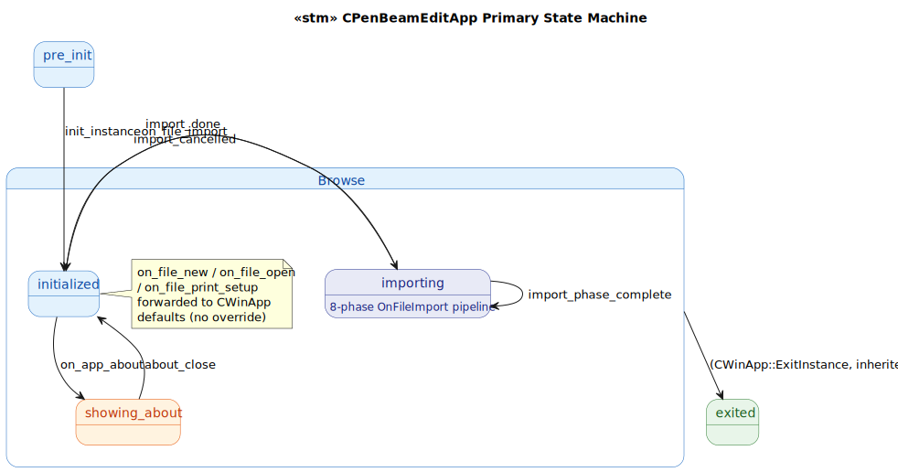
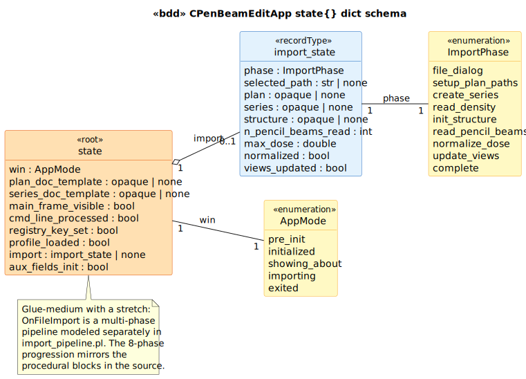
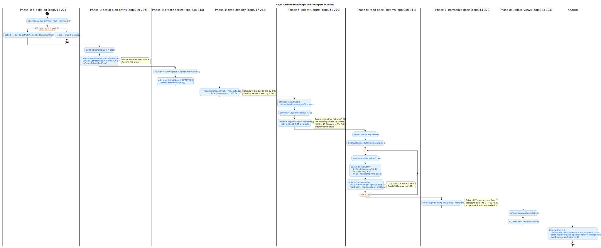

# CPenBeamEditApp State Model

`CPenBeamEditApp` is the `CWinApp` subclass for PenBeamEdit, the **2004 beamlet-editing testbed** that bridges the VSim visualization stack (`VSIM_OGL`) and the production dose-optimization stack (`RtModel`/`Brimstone`). Per `DEVELOPMENT_TIMELINE.md` Part 3, this is the architecturally pivotal intermediate point in the lineage — its [`TransitionPlan.txt`](../../../../PenBeamEdit/TransitionPlan.txt) reads as a literal migration diary documenting how the visualization stack and the dose model first interleaved on a shared event surface.

The state machine itself is moderately sized — similar in shape to CVSIM_OGLApp — but the heavy work happens inside `OnFileImport`, an 8-phase pipeline that synthesizes a CPlan from a directory of ASCII `.dat` files containing density + 99 pencil-beam doses. That pipeline lives in its own Prolog module ([`prolog/import_pipeline.pl`](prolog/import_pipeline.pl)) following the cpp-state-model skill convention for multi-phase background work.

## 1. Primary State Machine

**11 event terminals across 5 states** (`pre_init | initialized | showing_about | importing | exited`). The browse tier carries one modal sub-state (`showing_about` for `CAboutDlg.DoModal()`) and one scan-tier sub-state (`importing` for the OnFileImport pipeline).

> Source: [`diagrams/stm_primary.puml`](diagrams/stm_primary.puml)

The `importing` state is novel to this class — VSIM_OGL's app has no equivalent. Inside `importing`, the LTS dispatches `import_phase_complete` ticks driven by `import_pipeline:import_phase/3`; after 8 ticks the `import.phase` field reaches `complete` and `import_done` returns to `initialized`. The `import_cancelled` event handles the case where the file dialog returns non-IDOK at the very first phase.

## 2. State Dict Schema

> Source: [`diagrams/bdd_state_dict.puml`](diagrams/bdd_state_dict.puml)

| Field | Type | C++ source | Writers |
|---|---|---|---|
| `win` | `AppMode` | LTS-level | `init_instance`, `on_app_about`, `about_close`, `on_file_import`, `import_done`, `import_cancelled` |
| `plan_doc_template` | opaque | [`PenBeamEdit.cpp:125-130`](../../../../PenBeamEdit/PenBeamEdit.cpp#L125) | `init_instance` |
| `series_doc_template` | opaque | [`PenBeamEdit.cpp:135-140`](../../../../PenBeamEdit/PenBeamEdit.cpp#L135) | `init_instance` |
| `main_frame_visible` | `bool` | [`PenBeamEdit.cpp:151`](../../../../PenBeamEdit/PenBeamEdit.cpp#L151) | `init_instance` |
| `cmd_line_processed` | `bool` | [`PenBeamEdit.cpp:144-148`](../../../../PenBeamEdit/PenBeamEdit.cpp#L144) | `init_instance` |
| `registry_key_set` | `bool` | [`PenBeamEdit.cpp:109`](../../../../PenBeamEdit/PenBeamEdit.cpp#L109) | `init_instance` |
| `profile_loaded` | `bool` | [`PenBeamEdit.cpp:111`](../../../../PenBeamEdit/PenBeamEdit.cpp#L111) | `init_instance` |
| `import` | `import_state` \| `none` | LTS-level (anchors the pipeline) | `on_file_import` (sets), `import_done`/`import_cancelled` (clears) |

## 3. OnFileImport Pipeline (the heavy transition)

> Source: [`diagrams/act_data_pipeline.puml`](diagrams/act_data_pipeline.puml)

The 8 phases mirror the procedural blocks at [`PenBeamEdit.cpp:215-325`](../../../../PenBeamEdit/PenBeamEdit.cpp#L215):

| Phase | C++ block | What it does |
|---|---|---|
| 1. `file_dialog` | [`cpp:218-224`](../../../../PenBeamEdit/PenBeamEdit.cpp#L218) | Modal CFileDialog; non-IDOK exits early |
| 2. `setup_plan_paths` | [`cpp:226-236`](../../../../PenBeamEdit/PenBeamEdit.cpp#L226) | Get current CPlan via doc template; `SetPathName` twice (second wins) |
| 3. `create_series` | [`cpp:238-244`](../../../../PenBeamEdit/PenBeamEdit.cpp#L238) | `m_pSeriesDocTemplate->CreateNewDocument()`; SetPathName "IMPORT.SER" |
| 4. `read_density` | [`cpp:247-248`](../../../../PenBeamEdit/PenBeamEdit.cpp#L247) | `ReadAsciiImage(path + "\\density.dat", &series.volume, 1000.0)` |
| 5. `init_structure` | [`cpp:251-270`](../../../../PenBeamEdit/PenBeamEdit.cpp#L251) | Construct CStructure; init region with vertical strip (NOT all ones) |
| 6. `read_pencil_beams` | [`cpp:286-311`](../../../../PenBeamEdit/PenBeamEdit.cpp#L286) | Loop nAt=1..99: read dose%i.dat, gaussian-weight, accumulate |
| 7. `normalize_dose` | [`cpp:314-320`](../../../../PenBeamEdit/PenBeamEdit.cpp#L314) | Divide every dose voxel by maxDose |
| 8. `update_views` | [`cpp:323-324`](../../../../PenBeamEdit/PenBeamEdit.cpp#L323) | `pPlan->UpdateAllViews(NULL); m_pMainWnd->RedrawWindow()` |

The pipeline module also exposes the math directly: `pencil_beam_weight/3` reproduces the gaussian formula, and `is_in_initial_strip/3` reproduces the structure-region predicate. swipl can evaluate both.

## 4. Source quirks preserved verbatim

Seven C++ quirks across the App + pipeline; the LTS preserves all of them per the cpp-state-model fidelity rule:

1. **Dead `#if OLD` branch** at [`cpp:117-141`](../../../../PenBeamEdit/PenBeamEdit.cpp#L117). References `CPenBeamEditDoc` which doesn't exist anymore; the `#else` branch (CPlan + CPenBeamEditView) is what's compiled.

2. **`SetPathName` called twice** at [`cpp:232,235`](../../../../PenBeamEdit/PenBeamEdit.cpp#L232). First call uses `"ImportedPlan.pln"`, second uses `"IMPORT.PLN"`. Second wins; first is dead.

3. **Region-init "all ones" comment lies** at [`cpp:260`](../../../../PenBeamEdit/PenBeamEdit.cpp#L260). The loop only writes 1s where `nAtX > 45 && nAtX < 55` — a 9-voxel-wide vertical strip, not "all ones".

4. **Commented-out `m_pRegion` assignment** at [`cpp:253`](../../../../PenBeamEdit/PenBeamEdit.cpp#L253). The region is associated via `GetRegion()`-returned pointer instead.

5. **Off-by-one pencil beam loop** at [`cpp:286`](../../../../PenBeamEdit/PenBeamEdit.cpp#L286): `for (int nAt = 1; nAt < 100; nAt++)` reads 99 beams (`dose1.dat` .. `dose99.dat`), not 100 despite the variable hint.

6. **`nAtY` scope leak** at [`cpp:314`](../../../../PenBeamEdit/PenBeamEdit.cpp#L314). The outer loop reuses `nAtY` from cpp:261's outer loop without redeclaration. Pre-C++03 MSVC for-loop scope leak. Requires `/Zc:forScope-`.

7. **Off-by-a-factor in pencil-beam gaussian weight** at [`cpp:298-299`](../../../../PenBeamEdit/PenBeamEdit.cpp#L298). The denominator under sqrt is `sqrt(2*PI*sigma)` instead of the standard `sqrt(2*PI*sigma^2)`. The maxDose normalization at Phase 7 compensates, so the bug is invisible in the output.

## Source Mapping

| Event | C++ Source |
|---|---|
| `init_instance` | `PenBeamEdit.cpp:91-155` (`CPenBeamEditApp::InitInstance`) |
| `on_app_about` | `PenBeamEdit.cpp:64` (`ON_COMMAND(ID_APP_ABOUT, OnAppAbout)`) → `cpp:205-209` |
| `about_close` | modal close from `CAboutDlg::DoModal` |
| `on_file_import` | `PenBeamEdit.cpp:65` (`ON_COMMAND(ID_FILE_IMPORT, OnFileImport)`) → `cpp:215-325` |
| `import_phase_complete` | individual phase boundaries within `OnFileImport` |
| `import_done` | reaches `complete` after 8 ticks |
| `import_cancelled` | `cpp:219-220` (DoModal != IDOK) |
| `on_file_new` | `PenBeamEdit.cpp:68` (forwarded to `CWinApp::OnFileNew`) |
| `on_file_open` | `PenBeamEdit.cpp:69` (forwarded — NOT overridden, unlike CVSIM_OGLApp) |
| `on_file_print_setup` | `PenBeamEdit.cpp:71` (forwarded to `CWinApp::OnFilePrintSetup`) |

### Cross-language references

The closest counterpart is **`CBrimstoneApp` in [`Brimstone/Brimstone.cpp`](../../../../Brimstone/Brimstone.cpp)**, but the alignment is *partial*:

- The lifecycle bisimulates closely (init / about / file commands).
- `OnFileImport` has no direct counterpart — the modern Brimstone uses `CSeriesDicomImporter` for DICOM-RT import via `dcmtk` (the production version). The 8-phase ASCII-`.dat` pipeline modeled here was a research scaffold; the production code abandoned ASCII import entirely in favor of DICOM.
- The pencil-beam weight gaussian quirk is absent from the modern code (the optimizer learns weights rather than synthesizing them from a Gaussian).

The natural pairing for this LTS is therefore the modern **plus** the CSeriesDicomImporter LTS (pending — that's a Phase 3+ target). The bisimulation question becomes: *for the same input intent (a directory of dose data), do the two import paths produce equivalent CPlans modulo the format difference?*
