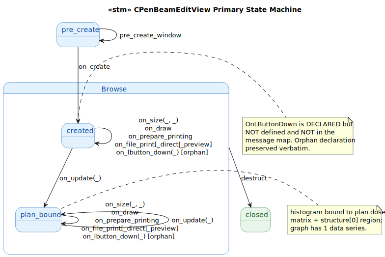
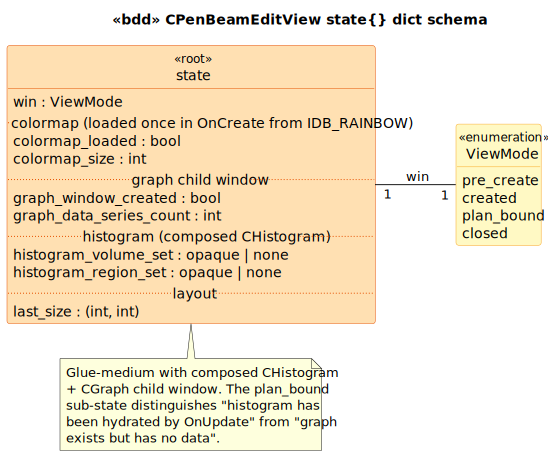
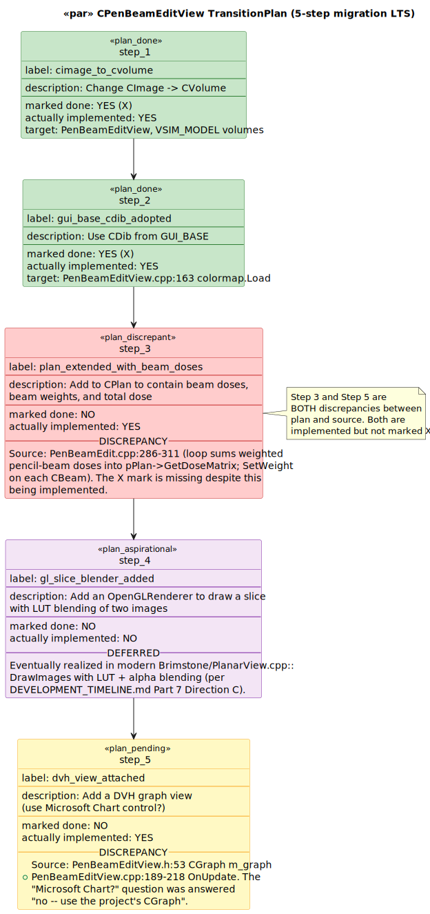

# CPenBeamEditView State Model

`CPenBeamEditView` is the `CView` subclass for PenBeamEdit — the testbed's main visualization. It draws a colormapped dose+density rendering on the left half of the client area and a cumulative DVH graph (via a `CGraph` child window) on the right half. The DVH is rebuilt on every `OnUpdate` call from the `CPlan`'s dose matrix and the structure-zero region.

This deliverable is **the heaviest of the PenBeamEdit trio** because it carries a fourth Prolog module — [`prolog/transition_plan.pl`](prolog/transition_plan.pl) — that transcribes the [`PenBeamEdit/TransitionPlan.txt`](../../../../PenBeamEdit/TransitionPlan.txt) migration plan as a labeled transition system, making the plan-vs-source discrepancies into checkable Prolog queries.

## 1. Primary State Machine

**11 event terminals across 4 states** (`pre_create | created | plan_bound | closed`). The `plan_bound` sub-state distinguishes "histogram has been hydrated from a plan via `OnUpdate`" from "view exists but graph has no data."



> Source: [`diagrams/stm_primary.puml`](diagrams/stm_primary.puml)

## 2. State Dict Schema



> Source: [`diagrams/bdd_state_dict.puml`](diagrams/bdd_state_dict.puml)

| Field | Type | C++ source |
|---|---|---|
| `win` | `ViewMode` | LTS-level |
| `colormap_loaded` / `colormap_size` | `bool`, `int` | [`PenBeamEditView.cpp:163-176`](../../../../PenBeamEdit/PenBeamEditView.cpp#L163) (CDib + IDB_RAINBOW) |
| `graph_window_created` | `bool` | [`PenBeamEditView.cpp:159-160`](../../../../PenBeamEdit/PenBeamEditView.cpp#L159) (m_graph.Create) |
| `graph_data_series_count` | `int` | [`PenBeamEditView.cpp:208-211`](../../../../PenBeamEdit/PenBeamEditView.cpp#L208) (RemoveAll + Add 1) |
| `histogram_volume_set` / `histogram_region_set` | opaque \| none | [`PenBeamEditView.cpp:198-203`](../../../../PenBeamEdit/PenBeamEditView.cpp#L198) |
| `last_size` | `(int, int)` | [`PenBeamEditView.cpp:181-187`](../../../../PenBeamEdit/PenBeamEditView.cpp#L181) (OnSize) |

## 3. Event → Predicate Transformation Map

| Event | Guard | Transformation | State Fields Affected |
|---|---|---|---|
| `pre_create_window` | `win == pre_create` | (no-op) | (none) |
| `on_create` | `win == pre_create` | `edit_ops:on_create` | `win`, `graph_window_created`, `colormap_loaded`, `colormap_size` |
| `on_size(Cx, Cy)` | `is_created_or_bound` | `edit_ops:on_size` | `last_size`; m_graph repositioned to right half (boundary) |
| `on_update(Hint)` | `is_created_or_bound` | `edit_ops:on_update` | `win` (→ `plan_bound`), `histogram_volume_set`, `histogram_region_set`, `graph_data_series_count` |
| `on_draw` | `is_created_or_bound` | (no-op; renders to DC) | (none) |
| `on_prepare_printing` | `is_created_or_bound` | (no-op) | (none) |
| `on_file_print` / `_direct` / `_preview` | `is_created_or_bound` | (forwarded to `CView`) | (none) |
| `on_lbutton_down(Pt)` | `is_created_or_bound` | (no-op) | (none) — orphan declaration |
| `destruct` | `is_created_or_bound` | direct | `win` (→ `closed`) |

## 4. TransitionPlan as a transcribed LTS



> Source: [`diagrams/par_transition_plan.puml`](diagrams/par_transition_plan.puml)

The 5 plan steps from [`PenBeamEdit/TransitionPlan.txt`](../../../../PenBeamEdit/TransitionPlan.txt):

| # | Step | Marked done | Actually implemented | Discrepancy? |
|---|---|---|---|---|
| 1 | `cimage_to_cvolume` | ✓ | ✓ | aligned |
| 2 | `gui_base_cdib_adopted` | ✓ | ✓ | aligned |
| 3 | `plan_extended_with_beam_doses` | ✗ | ✓ | **DISCREPANCY** — implemented but not marked |
| 4 | `gl_slice_blender_added` | ✗ | ✗ | aligned (deferred to modern Brimstone) |
| 5 | `dvh_view_attached` | ✗ | ✓ | **DISCREPANCY** — implemented but not marked |

Two of the five plan items are implemented in source but not marked done. The Prolog module makes this a query:

```prolog
?- transition_plan:step_actually_implemented(N), \+ transition_plan:step_done(N).
N = 3 ; N = 5 ;
```

Step 4 is the **truly aspirational** one — the OpenGL slice blender with LUT + alpha was never added to PenBeamEdit. It eventually appears in modern `Brimstone/PlanarView.cpp::DrawImages` (the slice rendering with LUT modulation by α-blend). That delayed realization is what makes PenBeamEdit the "bridging testbed" of `DEVELOPMENT_TIMELINE.md` Part 7: it sketched architectural moves that production code finished.

## 5. Source quirks preserved verbatim

1. **`OnLButtonDown` is an orphan declaration** at [`PenBeamEditView.h:68`](../../../../PenBeamEdit/PenBeamEditView.h#L68). Declared with `afx_msg` but **never defined** in the .cpp **and not in the BEGIN_MESSAGE_MAP block**. Likely a planned interactive feature (per the `TransitionPlan.txt` aspirations) that was never implemented. Preserved verbatim as an event terminal that produces no state change.

2. **`#ifdef SHOW_DOSE` is permanent** at [`PenBeamEditView.cpp:80`](../../../../PenBeamEdit/PenBeamEditView.cpp#L80). The macro is defined immediately above the conditional, so the dose-rendering branch is always taken. The `#else` branch (pure density grayscale) is dead code preserved verbatim.

3. **BGR-to-RGB swizzle** at [`PenBeamEditView.cpp:174`](../../../../PenBeamEdit/PenBeamEditView.cpp#L174). The colormap raw bits are read from a Win32 DIB in BGR order and assembled as `RGB(pRaw[2], pRaw[1], pRaw[0])`. Standard for Win32 DIB but a reviewer might mistake it for a bug.

4. **Physically-questionable dose/density blend** at [`PenBeamEditView.cpp:90-92`](../../../../PenBeamEdit/PenBeamEditView.cpp#L90). The render computes `intensity * GetRValue(color)` etc., directly multiplying density by the LUT-derived dose color. A proper render would window-and-level the CT then alpha-blend; this formula is preserved verbatim because it's load-bearing for visual matching.

5. **Hard-coded structure 0** at [`PenBeamEditView.cpp:201-202`](../../../../PenBeamEdit/PenBeamEditView.cpp#L201). `GetStructureAt(0)` is the only structure ever consulted. The testbed assumes a single structure (the strip-region synthesized by `OnFileImport`).

## Source Mapping

| Event | C++ Source |
|---|---|
| `pre_create_window` | `PenBeamEditView.cpp:45-51` |
| `on_create` | `PenBeamEditView.cpp:23` (`ON_WM_CREATE`) → `:153-179` |
| `on_size` | `PenBeamEditView.cpp:24` (`ON_WM_SIZE`) → `:181-187` |
| `on_update` | `PenBeamEditView.cpp:189-218` (virtual override; not in message map) |
| `on_draw` | `PenBeamEditView.cpp:56-108` (virtual override) |
| `on_prepare_printing` | `PenBeamEditView.cpp:113-117` |
| `on_file_print[_direct\|_preview]` | `PenBeamEditView.cpp:27-29` (forwarded to `CView`) |
| `on_lbutton_down` | `PenBeamEditView.h:68` (orphan declaration) |
| `destruct` | `PenBeamEditView.cpp:41-43` (~CPenBeamEditView, empty body) |

### Cross-language references

The closest counterpart in the modern stack is **`CPlanarView` in [`Brimstone/PlanarView.cpp`](../../../../Brimstone/PlanarView.cpp)** — also a slice-based 2-D viewer, also pairs CT volume rendering with overlays. The bisimulation candidates:

| `CPenBeamEditView` event | `CPlanarView` counterpart | Classification |
|---|---|---|
| `on_create` (loads colormap from IDB_RAINBOW + creates graph child) | `OnCreate` (multiple resources, no embedded graph) | tau-related |
| `on_size` | `OnSize` | bisimilar |
| `on_update(Hint)` | absent — modern view re-derives on every `OnDraw` | divergent — intentional |
| `on_draw` (dose+density per-pixel render) | `OnDraw` (LUT + α blend, see DEVELOPMENT_TIMELINE Part 7 algorithm table) | tau-related, more sophisticated |
| `on_lbutton_down(Pt)` (orphan) | implemented, drives contour editing | divergent — modern code completed the orphan |

The orphan `OnLButtonDown` at `PenBeamEditView.h:68` is the most striking pairing: PenBeamEdit declared the handler intent but never implemented it; modern Brimstone implements interactive contour editing via the same MFC message hook. The historical orphan is the predecessor of the modern feature.
