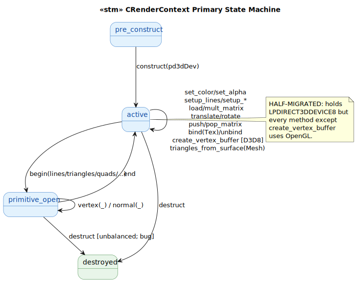
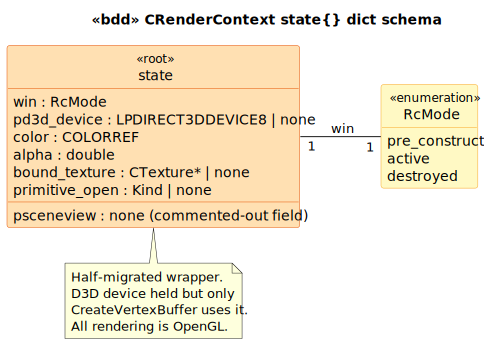

# CRenderContext State Model

`CRenderContext` is the "rendering API object" passed to `CRenderable` draw methods. Glue-medium with one major **half-migration** quirk:

> Holds a `LPDIRECT3DDEVICE8 m_pd3dDevice` but **all rendering methods still call OpenGL**. Only `CreateVertexBuffer` actually uses the D3D8 device. The D3D8 device handle and the OpenGL rendering context coexist incongruously.

This is consistent with the pattern across the historical cohort — partial migrations preserved verbatim (see also `c_beam_renderable` and `c_machine_renderable` for D3D8 leftovers in rendering classes).

## State Machine

> Source: [`diagrams/stm_primary.puml`](diagrams/stm_primary.puml)

## Schema

> Source: [`diagrams/bdd_state_dict.puml`](diagrams/bdd_state_dict.puml)

## Source quirks preserved verbatim

1. **Half-migrated**. `m_pd3dDevice` is only used in `CreateVertexBuffer` at [`cpp:36-44`](../../../../GEOM_VIEW/RenderContext.cpp#L36). Every other method (`BeginLines`, `Vertex`, `Normal`, `Color`, `LoadMatrix`, `PushMatrix`, `Bind`, ...) calls OpenGL functions directly. The class advertises D3D8 but renders via GL.

2. **Commented-out `m_pSceneView`** at [`RenderContext.h:90`](../../../../GEOM_VIEW/include/RenderContext.h#L90). Originally held a back-pointer to the view; replaced by the LPDIRECT3DDEVICE8 handle. The constructor signature comment at `.h:26` (`// CSceneView *pSceneView)`) still shows the old parameter — the comment wasn't updated when the signature changed.

3. **Commented-out `LineLoopFromPolygon`** at [`cpp:106-119`](../../../../GEOM_VIEW/RenderContext.cpp#L106). An earlier helper using `CPolygon`; replaced by `TrianglesFromSurface` which uses `CMesh`.

4. **TrianglesFromSurface has dead vertex pointer setup** at [`cpp:124,128`](../../../../GEOM_VIEW/RenderContext.cpp#L124). `glEnableClientState(GL_VERTEX_ARRAY)` and `glEnableClientState(GL_NORMAL_ARRAY)` are called, but the corresponding `glVertexPointer`/`glNormalPointer` calls are **commented out**. So vertex arrays are enabled but no data pointers are bound — `glDrawElements` would consume undefined memory. Real runtime issue preserved.

5. **Begin/End pairing not enforced.** The LTS state machine tracks `primitive_open` for sanity, but the C++ doesn't validate — calling `Vertex` outside a `Begin/End` pair silently calls `glVertex` with no active primitive, producing GL state errors.

## Source Mapping

| Event category | C++ Source |
|---|---|
| `construct(pd3dDev)` | `RenderContext.cpp:23-29` |
| `create_vertex_buffer(N, FVF)` | `RenderContext.cpp:36-44` (the ONLY D3D8 method) |
| `begin(Kind)` / `end` | `RenderContext.cpp:46-79` |
| `vertex/normal/triangles_from_surface` | `RenderContext.cpp:81-149` |
| `set_color/set_alpha` | `RenderContext.cpp:168-183` |
| `set_smooth_shading/set_lighting` | `RenderContext.cpp:185-201` |
| `setup_lines/setup_opaque/transp_*` | `RenderContext.cpp:203-231` |
| `load/mult_matrix`, `translate/rotate`, `push/pop_matrix` | `RenderContext.cpp:233-255` |
| `bind(Tex)/unbind` | `RenderContext.cpp:257-273` |
| `destruct` | `RenderContext.cpp:31-34` |
