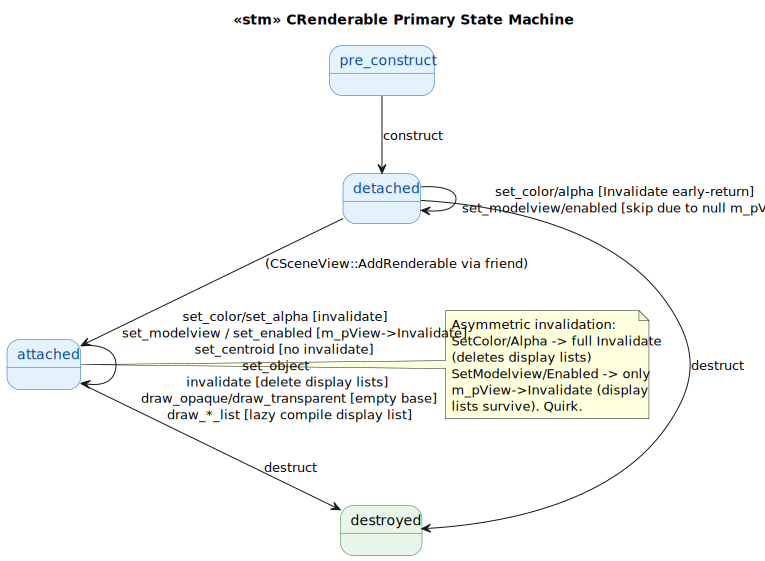
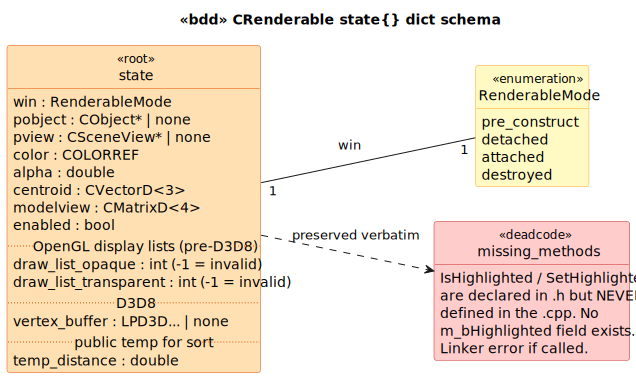

# CRenderable State Model

`CRenderable` is the **base class for every renderable in the cohort** — `CSurfaceRenderable`, `CDRRRenderable`, `CBeamRenderable` (RT_VIEW), `CMachineRenderable` (RT_VIEW), `CDRRRenderer` (VSIM_OGL). Glue-medium.

State holds the model-object pointer, color/alpha/modelview matrix, enabled flag, OpenGL display-list IDs, and a D3D8 vertex buffer.

## State Machine

> Source: [`diagrams/stm_primary.puml`](diagrams/stm_primary.puml)

## Schema

> Source: [`diagrams/bdd_state_dict.puml`](diagrams/bdd_state_dict.puml)

## The four preserved quirks

1. **Missing method implementations.** `IsHighlighted` / `SetHighlighted` are declared in [`Renderable.h:93-94`](../../../../GEOM_VIEW/include/Renderable.h#L93) but **NEVER defined** in `Renderable.cpp`. There is no `m_bHighlighted` member field. Any caller would get a linker error. Likely a planned feature that was never implemented — preserved verbatim as part of the documented public interface.

2. **SetupRenderingContext body block-commented.** [`cpp:286-301`](../../../../GEOM_VIEW/Renderable.cpp#L286). Originally set up OpenGL rendering state; the D3D8 migration left it as a no-op. Preserved.

3. **OpenGL display lists + D3D8 coexist.** `DrawOpaqueList`/`DrawTransparentList` ([`cpp:326-401`](../../../../GEOM_VIEW/Renderable.cpp#L326)) compile **GL display lists** around **D3D8** draw calls. Display lists can't capture D3D8 commands; the lazy-compile logic runs but produces empty display lists. Real runtime issue preserved.

4. **Asymmetric invalidation:**
   - `SetColor`/`SetAlpha` → unconditional full `Invalidate()` which deletes display lists ([`cpp:108,134`](../../../../GEOM_VIEW/Renderable.cpp#L108))
   - `SetModelviewMatrix`/`SetEnabled` → only `m_pView->Invalidate()` if view attached, NOT full Invalidate ([`cpp:206,234`](../../../../GEOM_VIEW/Renderable.cpp#L206))
   - `SetCentroid` → NO invalidate at all (centroid is for sort ordering only)

   So `SetColor` invalidates display lists but `SetModelviewMatrix` doesn't, even though both visibly change the rendered output. Quirk preserved.

The `c_renderable_record:triggers_invalidate/1` predicate enumerates the 4 setters that call Invalidate.

## Source Mapping

| Event | C++ Source |
|---|---|
| `construct` | `Renderable.cpp:38-47` |
| `set_object(O)` | `Renderable.cpp:82-85` |
| `set_color(C)` / `set_alpha(A)` | `Renderable.cpp:102-135` (both → Invalidate) |
| `set_centroid(V)` | `Renderable.cpp:155-160` (no Invalidate) |
| `set_modelview_matrix(M)` | `Renderable.cpp:200-211` (m_pView->Invalidate only) |
| `set_enabled(B)` | `Renderable.cpp:228-239` (m_pView->Invalidate only) |
| `invalidate` | `Renderable.cpp:246-279` |
| `draw_opaque/transparent` (base) | `Renderable.cpp:308-319` (empty) |
| `draw_*_list` | `Renderable.cpp:326-401` |
| `destruct` | `Renderable.cpp:54-56` (empty body) |
