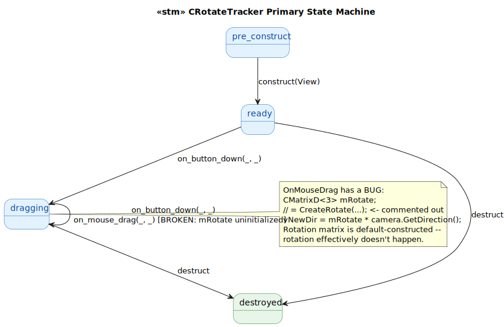
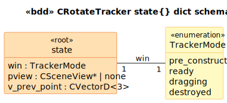

# CRotateTracker State Model

`CRotateTracker` is a `CTracker` subclass that rotates the view's camera direction around the camera target during a mouse drag. Glue-medium.

**Notable bug preserved verbatim:** at [`RotateTracker.cpp:89`](../../../../GEOM_VIEW/RotateTracker.cpp#L89):

```cpp
CMatrixD<3> mRotate; // = CreateRotate(m_vPrevPoint, vCurrPoint, 4.0);
```

The rotation matrix is **declared but never initialized** — the `CreateRotate(...)` call is commented out. mRotate is default-constructed; whether the rotation works depends on `CMatrixD<3>::CMatrixD()`:

- If identity-init: every drag tick multiplies camera.GetDirection by identity → **no rotation** (drag has no visible effect)
- If zero-init: vNewDir becomes the zero vector → **camera breaks**

Either way, the visible rotation feature is broken in this build. The CRotateTracker class declares the rotation behavior but the actual rotation math is missing.

## State Machine



> Source: [`diagrams/stm_primary.puml`](diagrams/stm_primary.puml)

## Schema



> Source: [`diagrams/bdd_state_dict.puml`](diagrams/bdd_state_dict.puml)

## Source Mapping

| Event | C++ Source |
|---|---|
| `construct(View)` | `RotateTracker.cpp:33-36` |
| `on_button_down(_, Point)` | `RotateTracker.cpp:53-66` |
| `on_mouse_drag(_, Point)` | `RotateTracker.cpp:74-103` (rotation math broken) |
| `destruct` | `RotateTracker.cpp:44-46` (empty body) |

OnButtonUp / OnMouseMove are NOT overridden — inherit the base's empty bodies.
