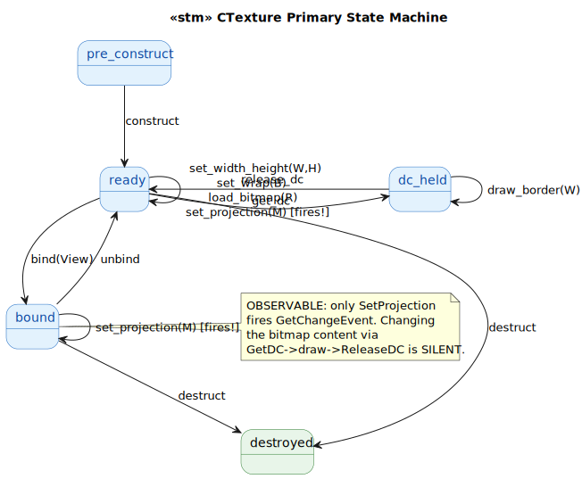
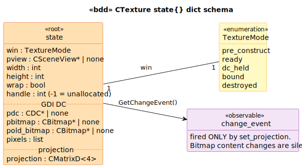

# CTexture State Model

`CTexture` is the base class for texture-mapping primitives. Concrete subclass: `CLightfieldTexture` (RT_VIEW). Glue-medium with a 4-state machine: `pre_construct → ready → dc_held → ready ↔ bound → destroyed`.

## State Machine

> Source: [`diagrams/stm_primary.puml`](diagrams/stm_primary.puml)

The `dc_held` sub-state captures the GDI DC lifecycle — between `GetDC` and `ReleaseDC` the bitmap is selected into a working DC for drawing. Calling `GetDC` twice in a row without an intervening `ReleaseDC` would leak the first DC (the LTS detects this via the `dc_held → dc_held` impossibility but the C++ doesn't validate).

## Schema

> Source: [`diagrams/bdd_state_dict.puml`](diagrams/bdd_state_dict.puml)

## Observable surface

**Only `SetProjection` fires `GetChangeEvent`** (per [`Texture.cpp:252`](../../../../GEOM_VIEW/Texture.cpp#L252)). The `c_texture_record:fires_change_event/1` predicate has a single entry.

This is a deliberate asymmetry preserved verbatim: changing the bitmap **content** via the `GetDC → draw → ReleaseDC` path is **silent** — observers attached to a CTexture cannot react to content changes, only to projection-matrix changes. A `CLightfieldTexture` subclass that redraws the surface inside `OnBeamChanged` (per `c_lightfield_texture` cohort) **cannot rely** on the base class to notify downstream observers of the content change; downstream observers must poll or wait for the next projection update.

Compare to:
- `CCamera` — 8 setters fire (every state-changing setter)
- `CBeam` — 9 setters fire
- `CTexture` — **only 1** setter fires

The texture is the most asymmetric observable in the cohort.

## Other preserved quirks

1. **GDI + OpenGL coexistence.** The class uses GDI primitives (`CDC`, `CBitmap`, `Rectangle`, `SelectObject`) for drawing **INTO** the texture surface, then uploads the bitmap bits to an OpenGL texture handle for rendering. Same pattern as `c_render_context` — Windows-only.

2. **OpenGL despite surrounding D3D8.** `CLight` went full D3D8 (D3DLIGHT8 inheritance); `CTexture` stays OpenGL (glBindTexture, glTexImage2D). Inconsistent migration across the GEOM_VIEW cohort.

3. **`m_nHandle = -1`** sentinel for unallocated. Set on first `Bind`; never cleared between binds (subsequent `Unbind` followed by `Bind` reuses the same handle).

## Source Mapping

| Event | C++ Source |
|---|---|
| `construct` | `Texture.cpp:26-30` |
| `set_width_height(W, H)` | `Texture.cpp:47-58` |
| `set_wrap(B)` | `Texture.cpp:65-68` |
| `get_dc` | `Texture.cpp:70-91` |
| `draw_border(W)` | `Texture.cpp:93-106` |
| `release_dc` | `Texture.cpp:108-127` |
| `process_transparency` | `Texture.cpp:129-149` |
| `load_bitmap(R)` | `Texture.cpp:151-176` |
| `set_projection(M)` | `Texture.cpp:248-253` (the only setter that fires) |
| `bind(View)` | `Texture.cpp:178-220` (friend-only) |
| `unbind` | `Texture.cpp:222-241` |
| `destruct` | `Texture.cpp:38-45` |
