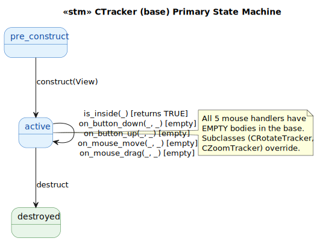
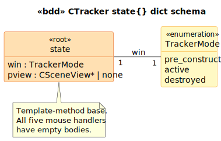

# CTracker State Model

`CTracker` is the abstract-ish base class for mouse-drag interaction trackers on a `CSceneView`. Glue-light: all five virtual methods (`IsInside`, `OnButtonDown`, `OnButtonUp`, `OnMouseMove`, `OnMouseDrag`) have **empty bodies** in the base — pure template-method pattern. Concrete subclasses (`CRotateTracker`, `CZoomTracker`) override the relevant handlers.

Referenced from VSIM_OGL: `CSimView::OnCreate` at [`simview.cpp:198-199`](../../../../VSIM_OGL/simview.cpp#L198) attaches a `CRotateTracker` as the left-button tracker and a `CZoomTracker` as the middle-button tracker.

## State Machine

> Source: [`diagrams/stm_primary.puml`](diagrams/stm_primary.puml)

## Schema

> Source: [`diagrams/bdd_state_dict.puml`](diagrams/bdd_state_dict.puml)

## Source Mapping

| Event | C++ Source |
|---|---|
| `construct(View)` | `Tracker.cpp:19-23` |
| `is_inside(Point)` | `Tracker.cpp:30-33` (returns `TRUE` unconditionally) |
| `on_button_down/up`, `on_mouse_move/drag` | `Tracker.cpp:35-49` (all empty bodies) |
| `destruct` | `Tracker.cpp:25-28` |
