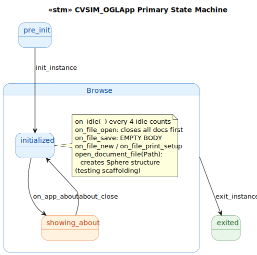
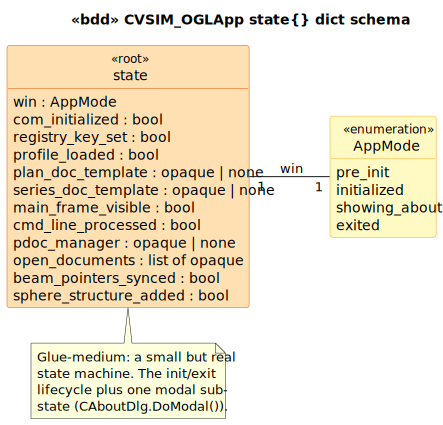

# CVSIM_OGLApp State Model

`CVSIM_OGLApp` is the `CWinApp` subclass for the VSIM_OGL CT-simulator prototype — the global application object that owns the main lifecycle (`InitInstance`/`ExitInstance`), registers document templates, and dispatches the small set of file/about menu commands. Glue-medium target: small but real state machine, one modal sub-state, several preserved C++ quirks.

## 1. Primary State Machine

**10 event terminals across 4 states** (`pre_init | initialized | showing_about | exited`). The lifecycle is straightforward: `pre_init → initialized` via `init_instance`, `initialized → showing_about → initialized` via `on_app_about` / `about_close`, and `initialized → exited` via `exit_instance`.

> Source: [`diagrams/stm_primary.puml`](diagrams/stm_primary.puml)

## 2. State Dict Schema

> Source: [`diagrams/bdd_state_dict.puml`](diagrams/bdd_state_dict.puml)

| Field | Type | Source | Written by |
|---|---|---|---|
| `win` | `AppMode` | LTS-level | `init_instance`, `on_app_about`, `about_close`, `exit_instance` |
| `com_initialized` | `bool` | [`VSIM_OGL.cpp:59`](../../../../VSIM_OGL/VSIM_OGL.cpp#L59), [`:204`](../../../../VSIM_OGL/VSIM_OGL.cpp#L204) | `init_instance` (true), `exit_instance` (false) |
| `registry_key_set` | `bool` | [`VSIM_OGL.cpp:78`](../../../../VSIM_OGL/VSIM_OGL.cpp#L78) | `init_instance` |
| `profile_loaded` | `bool` | [`VSIM_OGL.cpp:83`](../../../../VSIM_OGL/VSIM_OGL.cpp#L83) | `init_instance` |
| `plan_doc_template` | opaque | [`VSIM_OGL.cpp:99-104`](../../../../VSIM_OGL/VSIM_OGL.cpp#L99) | `init_instance` |
| `series_doc_template` | opaque | [`VSIM_OGL.cpp:109-114`](../../../../VSIM_OGL/VSIM_OGL.cpp#L109), [`:211`](../../../../VSIM_OGL/VSIM_OGL.cpp#L211) | `init_instance`, `exit_instance` (cleared) |
| `main_frame_visible` | `bool` | [`VSIM_OGL.cpp:129`](../../../../VSIM_OGL/VSIM_OGL.cpp#L129) | `init_instance` |
| `cmd_line_processed` | `bool` | [`VSIM_OGL.cpp:118-122`](../../../../VSIM_OGL/VSIM_OGL.cpp#L118) | `init_instance` |
| `open_documents` | list | inherited | `open_document_file`, `on_file_open`, `exit_instance` |
| `beam_pointers_synced` | `bool` | [`VSIM_OGL.cpp:133-138`](../../../../VSIM_OGL/VSIM_OGL.cpp#L133) | `init_instance` |
| `sphere_structure_added` | `bool` | [`VSIM_OGL.cpp:237`](../../../../VSIM_OGL/VSIM_OGL.cpp#L237) | `open_document_file` (always true) |

## 3. Event → Predicate Transformation Map

| Event | Guard | Transformation Predicates | State Fields Affected |
|---|---|---|---|
| `init_instance` | `win == pre_init` | `edit_ops:init_instance` | every initial-state field |
| `open_document_file(Path)` | `is_initialized` | `edit_ops:open_document_file` | `open_documents`, `sphere_structure_added` |
| `on_file_open` | `is_initialized` | `edit_ops:on_file_open` | `open_documents` (cleared) |
| `on_file_save` | `is_initialized` | (none — empty body) | (none) |
| `on_file_new` | `is_initialized` | (boundary: `CWinApp::OnFileNew`) | (none) |
| `on_file_print_setup` | `is_initialized` | (boundary: `CWinApp::OnFilePrintSetup`) | (none) |
| `on_app_about` | `is_initialized` | direct | `win` (→ `showing_about`) |
| `about_close` | `win == showing_about` | direct | `win` (→ `initialized`) |
| `on_idle(LCount)` | `is_initialized` | (no-op; body short-circuits) | (none) |
| `exit_instance` | `is_initialized` | `edit_ops:exit_instance` | `win`, `com_initialized`, `series_doc_template`, `open_documents` |

## 4. Source quirks preserved verbatim

1. **`OnFileSave` has an empty body** at [`VSIM_OGL.cpp:259-261`](../../../../VSIM_OGL/VSIM_OGL.cpp#L259). The `ID_FILE_SAVE` menu item is wired but does nothing.

2. **`OpenDocumentFile` always creates a sphere structure** at [`VSIM_OGL.cpp:237`](../../../../VSIM_OGL/VSIM_OGL.cpp#L237). Every successfully opened plan gets `pPlan->GetSeries()->CreateSphereStructure("Sphere")` appended — testing scaffolding shipped to production. Preserved verbatim; the LTS records `sphere_structure_added := true` on every open.

3. **The wizard-default doc/view triplet is dead code.** [`VSIM_OGL.cpp:91-97`](../../../../VSIM_OGL/VSIM_OGL.cpp#L91) is gated by `#ifdef DEFAULT_VIEW` which is not defined; the original `CVSIM_OGLDoc`/`CVSIM_OGLView` references are left in place.

4. **`OnIdle` short-circuits.** [`VSIM_OGL.cpp:248-257`](../../../../VSIM_OGL/VSIM_OGL.cpp#L248) gets the active view but discards it; the body returns `TRUE` immediately. Looks like a left-over experiment.

5. **FieldCOM integration is dead code.** [`VSIM_OGL.cpp:62-67`](../../../../VSIM_OGL/VSIM_OGL.cpp#L62) has `InitFieldCOMDLL` and `CDynLinkLibrary` commented out. The COM `#import` machinery in `CSimView::OnExportFieldcom` is the surviving reference; the linkage was abandoned at the App level.

## Source Mapping

| Event | C++ Source |
|---|---|
| `init_instance` | `VSIM_OGL.cpp:52` (`CVSIM_OGLApp::InitInstance`) |
| `exit_instance` | `VSIM_OGL.cpp:201` (`CVSIM_OGLApp::ExitInstance`) |
| `on_idle(LCount)` | `VSIM_OGL.cpp:248` (`OnIdle`) |
| `on_app_about` | `VSIM_OGL.cpp:25` (`ON_COMMAND(ID_APP_ABOUT, OnAppAbout)`) → `cpp:191-195` |
| `about_close` | modal close from `CAboutDlg::DoModal()` at `cpp:194` |
| `on_file_open` | `VSIM_OGL.cpp:26` (`ON_COMMAND(ID_FILE_OPEN, OnFileOpen)`) → `cpp:216-224` |
| `on_file_save` | `VSIM_OGL.cpp:259-261` (`OnFileSave` empty body) |
| `on_file_new` | `VSIM_OGL.cpp:29` (`ON_COMMAND(ID_FILE_NEW, CWinApp::OnFileNew)`) |
| `on_file_print_setup` | `VSIM_OGL.cpp:32` (`ON_COMMAND(ID_FILE_PRINT_SETUP, CWinApp::OnFilePrintSetup)`) |
| `open_document_file(Path)` | `VSIM_OGL.cpp:226` (virtual `OpenDocumentFile`) |

### Cross-language references

The natural counterpart in the modern Brimstone is **`CBrimstoneApp` in [`Brimstone/Brimstone.cpp`](../../../../Brimstone/Brimstone.cpp)** — also a `CWinApp` SDI shell, with `InitInstance`/`ExitInstance`, doc-template registration, and command handlers. The LTSs should align very closely on the lifecycle events. The interesting divergences will be:

- The `sphere_structure_added` testing scaffolding is absent from the modern app (intentional cleanup).
- The `OnFileSave` empty body is fixed in the modern app (it actually saves).
- The doc-template registration is single in the modern app (no separate "series doc template not added globally" dance).
- COM init/uninit may or may not still be present depending on whether DICOM features need it.

When the modern `CBrimstoneApp` LTS is drafted (a Phase 3 target per `DEVELOPMENT_TIMELINE.md` Part 7), this CVSIM_OGLApp deliverable becomes the historical antecedent in the bisimilarity chain.
