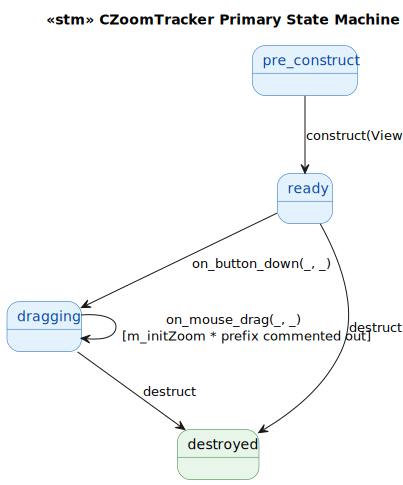
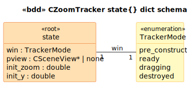

# CZoomTracker State Model

`CZoomTracker` is a `CTracker` subclass that adjusts the camera's distance during a mouse drag in the Y direction. Glue-medium. Companion to `CRotateTracker`.

**Preserved quirk** at [`ZoomTracker.cpp:93`](../../../../GEOM_VIEW/ZoomTracker.cpp#L93):

```cpp
double zoom = // m_initZoom *
    exp(2.0 * (m_initY - currY));
```

The `m_initZoom *` prefix is commented out, so the zoom factor is centered around 1.0 (per drag) regardless of starting distance. With the multiplier (intended behavior) it would scale to the absolute starting distance. The visible zoom still works — `SetDistance(m_initZoom / zoom)` produces a relative zoom — but the math is degraded vs. the original intent. Preserved verbatim.

Also at [`cpp:98`](../../../../GEOM_VIEW/ZoomTracker.cpp#L98): `// m_pView->GetCamera().SetZoom(zoom);` commented out; replaced by `SetDistance(m_initZoom / zoom)`. The API renamed `Zoom` → `Distance` at some point.

## State Machine



> Source: [`diagrams/stm_primary.puml`](diagrams/stm_primary.puml)

## Schema



> Source: [`diagrams/bdd_state_dict.puml`](diagrams/bdd_state_dict.puml)

## Source Mapping

| Event | C++ Source |
|---|---|
| `construct(View)` | `ZoomTracker.cpp:33-36` |
| `on_button_down(_, _)` | `ZoomTracker.cpp:54-70` |
| `on_mouse_drag(_, _)` | `ZoomTracker.cpp:78-102` |
| `destruct` | `ZoomTracker.cpp:44-46` (empty body) |
