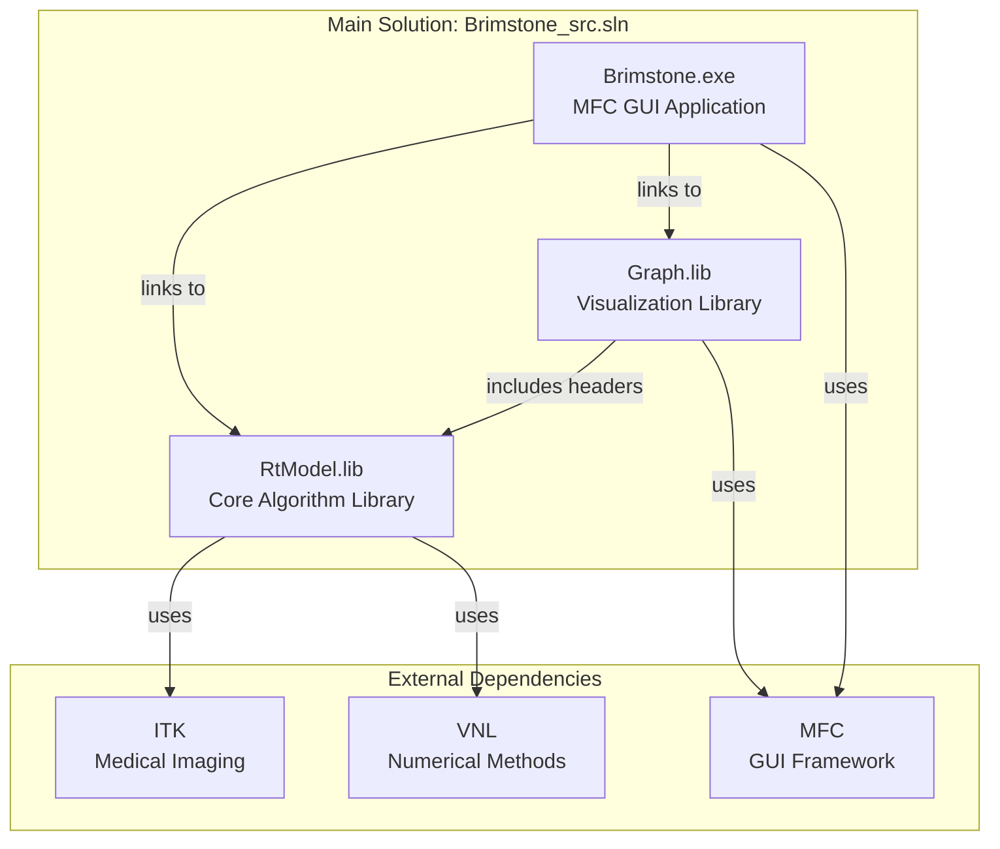

# dH Repository Structure - Solutions, Projects, Applications, and Libraries

## Main Production System

```
Brimstone_src.sln (Main Solution)
│
├─── Brimstone (Application - MFC GUI)
│    │   Type: Executable (.exe)
│    │   Entry: CBrimstoneApp::InitInstance()
│    │   Purpose: Radiotherapy treatment planning GUI
│    │
│    ├─→ depends on: RtModel (library)
│    └─→ depends on: Graph (library)
│
├─── RtModel (Library - Core Algorithm)
│    │   Type: Static Library (.lib)
│    │   Purpose: Optimization, dose calculation, data models
│    │   Dependencies: ITK, VNL (external)
│    │
│    └─→ no internal project dependencies
│
└─── Graph (Library - Visualization)
     │   Type: Static Library (.lib)
     │   Purpose: DVH graphs, visualization components
     │
     └─→ depends on: RtModel (library)
```

## Component Libraries (Foundation)

### Geometry & Modeling
```
GEOM_BASE/          → Base geometry primitives
GEOM_MODEL/         → Geometric modeling (contours, regions)
  └─ Tests:
     ├─ ClusterTest (GUI app)
     ├─ TestRegion (console: Test_GEOM_MODEL.sln)
     ├─ TestRotate (console)
     └─ TestIliffe (console)

GEOM_VIEW/          → Geometry visualization
MODEL_BASE/         → Base model framework
  └─ Test/ (console)
```

### Math & Optimization
```
VecMat/             → Vector/matrix library
  └─ TestVec/ (console)
VecMat_original/    → Original version
  └─ TestVec/ (console)

OPTIMIZER_BASE/     → Base optimization framework
  └─ Test/ (console: OPTIMIZER_BASE_Test.sln)

OptimizeN/          → N-dimensional optimization
  └─ Test/ (console: OPTIMIZER_BASE_Test.sln)
```

### Template Libraries
```
MTL/                → Math Template Library
  └─ TestMTL/ (console: TestMTL.sln)

FTL/                → Foundation Template Library
                      (Solution: FTL.sln)
```

### Visualization
```
OGL_BASE/           → OpenGL base classes
VSIM_OGL/           → Visual simulation with OpenGL
                      (GUI app)

VSIM_MODEL/         → Simulation model
  └─ Test/ (console: VSIM_MODEL_TEST.cpp)

GUI_BASE/           → Base GUI components
  └─ Test/scribble (GUI app)
```

### RT-Specific Utilities
```
RT_MODEL/           → Radiotherapy model components
  ├─ GenBeamlets/ (console) - Generate beamlets
  ├─ GenDens/ (console) - Generate density
  ├─ DicomImEx/ (console) - DICOM import/export
  ├─ TestHisto/ (console: TestHisto.sln)
  └─ Test/ (console)

RT_VIEW/            → Radiotherapy visualization

DivFluence/         → Divergent fluence calculations
  ├─ DivFluence.cpp (console)
  └─ OrigDivFluence.cpp (console)
```

### Other Components
```
PenBeamEdit/        → Pencil beam editor (GUI app)
PenBeam_indens/     → Pencil beam in-density

FieldCOM/           → Field COM components
GenImaging/         → General imaging utilities

XMLLogging/         → XML logging framework
  ├─ XMLConsole/ (GUI app)
  └─ TestXMLLogging/ (console)
```

## Repository Versions
```
Brimstone_original/ → Original Brimstone GUI (alternate version)
Graph_original/     → Original Graph library
```

## Dependency Graph

### Main System Dependencies


### Library Hierarchy
```
Foundation Layer:
    FTL, MTL, VecMat
    ↓
Base Layer:
    GEOM_BASE, MODEL_BASE, OPTIMIZER_BASE, OGL_BASE, GUI_BASE
    ↓
Model Layer:
    GEOM_MODEL, VSIM_MODEL
    ↓
RT-Specific Layer:
    RT_MODEL → RtModel (production)
    ↓
View Layer:
    GEOM_VIEW, RT_VIEW, Graph
    ↓
Application Layer:
    Brimstone, PenBeamEdit, VSIM_OGL, XMLConsole
    ↓
Utility Layer:
    DivFluence, GenBeamlets, GenDens, DicomImEx
```

## Summary Statistics

### Solutions: 9
- **Brimstone_src.sln** (main production)
- Brimstone/Brimstone.sln (alternate)
- Brimstone_original/Brimstone.sln
- FTL/FTL.sln
- GEOM_MODEL/TestRegion/Test_GEOM_MODEL.sln
- MTL/TestMTL/TestMTL.sln
- OptimizeN/Test/OPTIMIZER_BASE_Test.sln
- RT_MODEL/TestHisto/TestHisto.sln
- notebook_zoo/entropy_max.sln

### Applications: 25 total
- **GUI Applications: 7**
  - Brimstone (main)
  - Brimstone_original
  - PenBeamEdit
  - XMLConsole
  - VSIM_OGL
  - ClusterTest
  - Scribble (test)

- **Console Applications: 18**
  - DivFluence (2 versions)
  - GenBeamlets
  - GenDens
  - DicomImEx (DICOM I/O)
  - TestHisto
  - Test_GEOM_MODEL (3 tests)
  - TestMTL
  - OPTIMIZER_BASE_Test (2 versions)
  - TestVecMat (2 versions)
  - VSIM_MODEL_TEST (2 versions)
  - TestXMLLogging
  - MODEL_BASE Test

### Libraries: 20+
- **Production Libraries (3):** RtModel, Graph, (Brimstone as framework)
- **Foundation (6):** FTL, MTL, VecMat, GEOM_BASE, MODEL_BASE, OPTIMIZER_BASE
- **Model (5):** GEOM_MODEL, VSIM_MODEL, RT_MODEL, OptimizeN, PenBeam_indens
- **View (5):** GEOM_VIEW, RT_VIEW, OGL_BASE, GUI_BASE, FieldCOM
- **Utility (3):** XMLLogging, GenImaging, DivFluence

### Python Utilities
- **python/** - ITK-based CT density processing scripts

## Key Relationships

1. **Brimstone** is the main application that depends on **RtModel** and **Graph**
2. **Graph** depends on **RtModel** for data structures
3. **RtModel** is self-contained but uses external ITK/VNL libraries
4. Multiple test/utility applications exist for component validation
5. Foundation libraries (VecMat, GEOM_BASE, OPTIMIZER_BASE) support higher-level components
6. RT-specific components (RT_MODEL, RT_VIEW) extend the general framework
